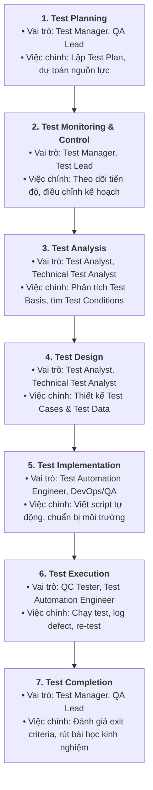
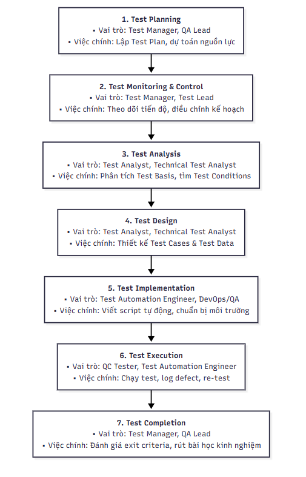

# BÁO CÁO BÀI TẬP HW01: JOBS · DEFECTS · TEST A PHYSICAL PRODUCT
**CS423 / CSC13003 – Software Testing (AI-augmented · 2026)**  
**Giảng viên phụ trách:** TS. Lâm Quang Vũ, TS. Trần Duy Hoàng, ThS. Trần Thị Bích Hạnh, ThS. Trương Phước Lộc, ThS. Hồ Tuấn Thanh  

---

## 📌 THÔNG TIN SINH VIÊN & BÀI NỘP

| Thông tin | Chi tiết |
| :--- | :--- |
| **Họ và tên:** | Trần Gia Cường |
| **Mã số sinh viên (MSSV):** | 23120225 |
| **Lớp / Khóa:** | CQ2023/3 |
| **Mã bài tập (Exercise ID):** | HW01 |
| **Ngày nộp bài:** | 27/09/2026 |
| **GitHub Repository Link:** | [https://github.com/trancuonG05/SoftwareTesting-HW01.git] |
| **Điểm tự đánh giá (3 chữ số):** | [Ví dụ: 095 / 100] |

---

## 📑 MỤC LỤC
1. [REQUIREMENT 1 – QA/QC JOB MARKET 2026+](#requirement-1--qaqc-job-market-2026-40-pts)
   - 1.1. [Bảng tổng hợp 10 tin tuyển dụng QA/QC](#11-bảng-tổng-hợp-10-tin-tuyển-dụng-qaqc)
   - 1.2. [Chi tiết 10 tin tuyển dụng & AI Impact Analysis](#12-chi-tiết-10-tin-tuyển-dụng--ai-impact-analysis)
   - 1.3. [CLO G9.1: Mindmap vai trò QA/QC theo chuẩn ISTQB & Phản biện AI](#13-clo-g91-mindmap-vai-trò-qaqc-theo-chuẩn-istqb--phản-biện-ai)
2. [REQUIREMENT 2 – 20 SOFTWARE DEFECTS 2022–2026](#requirement-2--20-software-defects-20222026-20-pts)
   - 2.1. [Bảng tổng hợp 20 sự cố phần mềm](#21-bảng-tổng-hợp-20-sự-cố-phần-mềm)
   - 2.2. [Chi tiết 20 lỗi phần mềm](#22-chi-tiết-20-lỗi-phần-mềm)
   - 2.3. [Phát hiện Ảo giác (Hallucination) hoặc Thiên kiến (Bias) của AI](#23-phát-hiện-ảo-giác-hallucination-hoặc-thiên-kiến-bias-của-ai)
3. [REQUIREMENT 3 – TEST A PHYSICAL PRODUCT](#requirement-3--test-a-physical-product-25-pts)
   - 3.1. [Thông tin thiết bị & Ảnh minh chứng chính chủ](#31-thông-tin-thiết-bị--ảnh-minh-chứng-chính-chủ)
   - 3.2. [Bảng thiết kế 15 Test Cases](#32-bảng-thiết-kế-15-test-cases)
   - 3.3. [Thực thi thực tế & Danh sách Video Demo](#33-thực-thi-thực-tế--danh-sách-video-demo)
4. [AI COLLABORATION PROTOCOL & COMPLIANCE](#ai-collaboration-protocol--compliance-15-pts)
   - 4.1. [AI Audit Report (Theo mẫu [AI-02])](#41-ai-audit-report-theo-mẫu-ai-02)
   - 4.2. [AI Critique (200–300 từ)](#42-ai-critique-200300-từ)
   - 4.3. [Mandatory Disclosure (Cam kết theo mẫu [AI-03])](#43-mandatory-disclosure-cam-kết-theo-mẫu-ai-03)
   - 4.4. [Bằng chứng chống gian lận & Kích hoạt FIT Mantis](#44-bằng-chứng-chống-gian-lận--kích-hoạt-fit-mantis)
5. [RUBRIC TỰ CHẤM ĐIỂM (SELF-ASSESSMENT)](#rubric-tự-chấm-điểm-self-assessment)

---

# REQUIREMENT 1 – QA/QC JOB MARKET 2026+ (40 PTS)

## 1.1. Bảng tổng hợp 10 tin tuyển dụng QA/QC

| STT | Tên vị trí tuyển dụng | Công ty / Nền tảng | Mức lương | Ngày đăng | Yêu cầu kỹ năng AI? |
| :---: | :--- | :--- | :--- | :---: | :---: |
| 1 | QA Engineer (Tester, QA QC, English) | Saritasa / ITviec | $1,000 – $1,500 USD | 24/09/2026 | **Có (Skills: AI)** |
| 2 | Middle/Senior Automation QC (Tester, QA QC) | Saigon Technology / ITviec | Thỏa thuận (Cạnh tranh) | 24/09/2026 | Không (Automation) |
| 3 | Manual Tester (QA QC) | QIG Group / ITviec | $500 – $1,200 USD | 23/09/2026 | Không (Manual) |
| 4 | Junior / Middle QA Software (Tester, QA QC) | Golden Gate / ITviec | Thỏa thuận (Cạnh tranh) | 21/09/2026 | Không (Web Services) |
| 5 | Manual/Automation Tester - Quality Analyst (QA QC) | MiTek Vietnam / ITviec | Thỏa thuận (Cạnh tranh) | 14/09/2026 | Không (Automation/Python) |
| 6 | Automation Tester (QA QC/ Japanese N3+) | TrustedAI / ITviec | $800 – $1,500 USD | 23/09/2026 | **Có (AI Software & Services)** |
| 7 | Process Quality Assurance (PQA, QA QC) | ECARX / ITviec | Thỏa thuận (Cạnh tranh) | 19/09/2026 | Không (PQA/Automotive) |
| 8 | QA Engineer (Tester/ QA QC) | OL Vietnam / ITviec | Thỏa thuận (Cạnh tranh) | 28/08/2026 | Không (Digital Asset) |
| 9 | Middle QA/QC Engineer (Automation) | Siraya Technologies / ITviec | Thỏa thuận (Cạnh tranh) | 22/09/2026 | Không (Automation/Golang) |
| 10 | Software Development Engineer in Test (SDET) | ANDPAD VietNam / ITviec | Thỏa thuận (Cạnh tranh) | 22/09/2026 | **Có (AI-driven Apps)** |

---

## 1.2. Chi tiết 10 tin tuyển dụng & AI Impact Analysis

### Job #01: QA Engineer (Tester, QA QC, English) – Saritasa *(Vị trí có kỹ năng AI #1)*
* **Đường dẫn (Link gốc):** https://itviec.com/it-jobs/qa-engineer-tester-qa-qc-english-up-to-1500-saritasa-4856
* **Ngày đăng tuyển:** 24/09/2026 (trong vòng 60 ngày)
* **Mức lương:** $1,000 – $1,500 USD
* **Yêu cầu kỹ năng chính (Skills Required):** AI, Integration test, QA QC, Process Quality Assurance (PQA), English, làm việc với các hệ thống hiện đại (Big Data, IoT, VR/AR, Cloud AWS/Azure/GCP).
* **Mô tả công việc tóm tắt (JD Summary):**
  - Thực hiện kiểm thử tích hợp (Integration testing) và đảm bảo chất lượng quy trình (PQA) cho các giải pháp đa nền tảng (IoT, VR/AR, Big Data, Web/Mobile, Unity Gaming).
  - Phối hợp chặt chẽ trong nhóm đa chức năng (Developers, DevOps, QA) để review code, test chéo và đưa ra phản hồi cải tiến chất lượng liên tục.
  - Ứng dụng các công nghệ mới và AI vào quy trình kiểm thử nhằm tối ưu hóa năng suất và xử lý các bài toán kỹ thuật phức tạp.
* **Ảnh minh chứng tuyển dụng (Anti-cheat):**
  
    

* **AI Impact Analysis (1–2 câu):**
  > Với việc dự án tích hợp các công nghệ mới nổi (IoT, VR/AR, Big Data), AI hỗ trợ kỹ sư QA tự động sinh dữ liệu kiểm thử giả lập (mock data) và phân tích các luồng tích hợp phức tạp giữa các dịch vụ. Tuy nhiên, kỹ sư QA vẫn giữ vai trò quyết định trong việc thẩm định chất lượng quy trình (PQA), đánh giá trải nghiệm thực tế (human-in-the-loop) và giao tiếp trực tiếp bằng tiếng Anh với các bên liên quan.

---

### Job #02: Middle/Senior Automation QC (Tester, QA QC) – Saigon Technology
* **Đường dẫn (Link gốc):** https://itviec.com/it-jobs/middle-senior-automation-qc-tester-qa-qc-saigon-technology-4350
* **Ngày đăng tuyển:** 24/09/2026
* **Mức lương:** Thỏa thuận (Chính sách đãi ngộ cạnh tranh - "You'll love it")
* **Yêu cầu kỹ năng chính:** Playwright, API Testing, CI/CD, Zephyr, Automation Test Frameworks, QA QC.
* **Mô tả công việc tóm tắt:**
  - Thiết kế, phát triển, bảo trì và nâng cao các framework kiểm thử tự động (Automation Testing Frameworks) cho ứng dụng Web và dịch vụ Backend (API).
  - Đảm bảo các tiêu chuẩn chất lượng và thực hành kiểm thử tốt nhất (best practices) được thực thi xuyên suốt vòng đời dự án.
  - Tích hợp các bộ test tự động vào quy trình CI/CD và quản trị trường hợp kiểm thử trên Zephyr.
* **Ảnh minh chứng tuyển dụng:**  
  
    

* **AI Impact Analysis (1–2 câu):**  
  > Các công cụ AI hiện đại (như Playwright AI Agents, Copilot) hỗ trợ tăng tốc viết test script từ ngôn ngữ tự nhiên và tự động phục hồi bộ định vị (self-healing locators) khi giao diện UI thay đổi. Tuy nhiên, kỹ sư Middle/Senior Automation vẫn giữ vai trò then chốt trong việc thiết kế kiến trúc framework mở rộng, tích hợp pipeline CI/CD ổn định và quản lý rủi ro kiểm thử mà AI chưa thể tự quyết định.

---

### Job #03: Manual Tester (QA QC) – Công ty Cổ phần Tập đoàn Công nghệ Quảng Ích (QIG)
* **Đường dẫn (Link gốc):** https://itviec.com/it-jobs/manual-tester-qa-qc-cong-ty-co-phan-tap-doan-cong-nghe-quang-ich-qig-3723
* **Ngày đăng tuyển:** 23/09/2026
* **Mức lương:** $500 – $1,200 USD
* **Yêu cầu kỹ năng chính:** Tester, Mobile Apps, QA QC, phân loại lỗi và quản lý bug.
* **Mô tả công việc tóm tắt:**
  - Lập test plan, thiết kế test case, chuẩn bị dữ liệu và môi trường test cho các hệ thống phần mềm và ứng dụng mobile giáo dục.
  - Thực hiện kiểm thử chức năng, phát hiện và log bugs chi tiết, đánh giá mức độ nghiêm trọng và tính khẩn cấp của lỗi.
  - Phối hợp chặt chẽ với đội ngũ Developer để xác minh sửa lỗi, phân tích và theo dõi kết quả test, đề xuất cải tiến quy trình.
* **Ảnh minh chứng tuyển dụng:**  
    
* **AI Impact Analysis (1–2 câu):**  
  > AI hỗ trợ Tester sinh nhanh các bộ test case chức năng cơ bản từ tài liệu mô tả yêu cầu (BRD) và tự động tóm tắt bug report. Tuy nhiên, các bài test trải nghiệm người dùng thực tế (UX/UI testing) trên đa dạng thiết bị di động trong lĩnh vực giáo dục vẫn phụ thuộc hoàn toàn vào sự tỉ mỉ và trực giác kiểm thử của Tester thủ công.

---

### Job #04: Junior / Middle QA Software (Tester, QA QC) – CÔNG TY TNHH DỊCH VỤ GIÁ TRỊ GIA TĂNG GOLDENGATE
* **Đường dẫn (Link gốc):** https://itviec.com/it-jobs/junior-middle-software-qa-tester-qa-qc-cong-ty-tnhh-dich-vu-gia-tri-gia-tang-goldengate-4907
* **Ngày đăng tuyển:** 21/09/2026
* **Mức lương:** Thỏa thuận
* **Yêu cầu kỹ năng chính:** QA QC, Automation Test, Tester, kiểm thử dịch vụ Web và sản phẩm phần mềm.
* **Mô tả công việc tóm tắt:**
  - Tham gia vào các dự án phát triển phần mềm, xây dựng và thực thi các kịch bản kiểm thử kết hợp thủ công và tự động cho sản phẩm dịch vụ web.
  - Kiểm tra tính đúng đắn của logic nghiệp vụ, phát hiện khiếm khuyết phần mềm và phối hợp các bên liên quan để nghiệm thu chức năng.
* **Ảnh minh chứng tuyển dụng:**  
    
* **AI Impact Analysis (1–2 câu):**  
  > AI đang dần thay thế các tác vụ lặp đi lặp lại như chuẩn bị dữ liệu thử nghiệm biên và sinh test script cho các luồng web cơ bản. Kỹ sư Junior/Middle cần học cách phối hợp với AI Assistant để mở rộng độ bao phủ kiểm thử, tập trung nguồn lực vào việc kiểm chứng logic nghiệp vụ đặc thù của chuỗi dịch vụ.

---

### Job #05: Manual/Automation Tester - Quality Analyst (QA QC) – MiTek Vietnam
* **Đường dẫn (Link gốc):** https://itviec.com/it-jobs/manual-automation-tester-selenium-qa-qc-mitek-vietnam-0430
* **Ngày đăng tuyển:** 14/09/2026
* **Mức lương:** Thỏa thuận 
* **Yêu cầu kỹ năng chính:** QA QC, Automation Test, JavaScript, Python, Tester, English, kiểm thử Web / Windows Apps / API.
* **Mô tả công việc tóm tắt:**
  - Thiết kế, phát triển, duy trì và thực thi test cases cho kiểm thử chức năng, hồi quy và tự động trên nền tảng phần mềm xây dựng Kova (Web, Windows applications và APIs).
  - Xây dựng và duy trì test scripts tự động sử dụng Python và JavaScript, đảm bảo tính ổn định của hệ thống quy mô lớn.
* **Ảnh minh chứng tuyển dụng:**  
    
* **AI Impact Analysis (1–2 câu):**  
  > Các nền tảng AI có thể hỗ trợ phân tích sự thay đổi mã nguồn (code diff analysis) để tự động đề xuất các kịch bản kiểm thử hồi quy cần chạy lại cho ứng dụng đa nền tảng (Web + Desktop). Dù vậy, kỹ sư QA con người vẫn phải chịu trách nhiệm thẩm định tính toàn vẹn của các phép tính kỹ thuật ngành xây dựng và tính ổn định của test suite.

---

### Job #06: Automation Tester (QA QC/ Japanese N3+) – TrustedAI *(Vị trí có kỹ năng AI #2)*
* **Đường dẫn (Link gốc):** https://itviec.com/it-jobs/automation-tester-qa-qc-tester-japanese-n3-trustedai-2550
* **Ngày đăng tuyển:** 23/09/2026
* **Mức lương:** $800 – $1,500 USD
* **Yêu cầu kỹ năng chính:** Automation Test, Japanese N3+, AI, QA QC, kiểm thử phần mềm dịch vụ AI (AI Software & Services).
* **Mô tả công việc tóm tắt:**
  - Thiết kế quy trình kiểm thử và phạm vi test rủi ro cho các dự án phần mềm và dịch vụ AI phục vụ thị trường Nhật Bản.
  - Thực hiện kiểm thử chức năng, hồi quy đa nền tảng/thiết bị, kiểm thử tương thích đa ngôn ngữ (tiếng Nhật, tiếng Việt, tiếng Anh).
  - Tự động hóa quy trình test, xây dựng và duy trì tài liệu test case, checklist QC, theo dõi vòng đời xử lý bug.
* **Ảnh minh chứng tuyển dụng:**  
    
* **AI Impact Analysis (1–2 câu):**  
  > Đây là vai trò trực tiếp kiểm thử các hệ thống AI (Testing OF AI), đòi hỏi kỹ sư phải đánh giá tính chính xác, an toàn và độ tin cậy của mô hình AI đối với ngôn ngữ và văn hóa Nhật Bản. AI đóng vai trò vừa là đối tượng kiểm thử (SUT), vừa là công cụ hỗ trợ sinh dữ liệu đối kháng (adversarial testing) dưới sự kiểm soát chặt chẽ của kỹ sư QA.

---

### Job #07: Process Quality Assurance (PQA, QA QC) – CÔNG TY TNHH ECARX
* **Đường dẫn (Link gốc):** https://itviec.com/it-jobs/process-quality-assurance-pqa-qa-qc-cong-ty-tnhh-ecarx-4345
* **Ngày đăng tuyển:** 19/09/2026
* **Mức lương:** Thỏa thuận 
* **Yêu cầu kỹ năng chính:** PQA, English, Agile, Jira, Project Management, QA QC, quy chuẩn chất lượng phần mềm ô tô (ASPICE).
* **Mô tả công việc tóm tắt:**
  - Tham gia toàn bộ quy trình phát triển dự án, đảm bảo chất lượng bàn giao phần mềm thông qua quản lý vấn đề và lập kế hoạch kiểm toán (audit plan) trong mọi giai đoạn R&D.
  - Quản lý bảng Jira, dashboards và kanban để điều phối hoạt động chất lượng; giao tiếp với khách hàng xác nhận vấn đề và thương lượng mục tiêu chất lượng.
  - Xây dựng hệ thống chất lượng đáp ứng các yêu cầu khắt khe của khách hàng và các tiêu chuẩn cấp cao như ASPICE.
* **Ảnh minh chứng tuyển dụng:**  
    
* **AI Impact Analysis (1–2 câu):**  
  > AI hỗ trợ hiệu quả trong việc tự động quét các chỉ số tuân thủ quy trình, tổng hợp báo cáo kiểm toán định kỳ và dự báo rủi ro chất lượng từ dữ liệu Jira. Tuy nhiên, vai trò PQA trong lĩnh vực ô tô thông minh đòi hỏi sự tuân thủ nghiêm ngặt các quy chuẩn an toàn quốc tế (như ASPICE, ISO 26262), nơi con người bắt buộc phải chịu trách nhiệm pháp lý và ra quyết định kiểm định cuối cùng.

---

### Job #08: QA Engineer (Tester/ QA QC) – OL Vietnam
* **Đường dẫn (Link gốc):** https://itviec.com/it-jobs/qa-engineer-tester-qa-qc-ol-vietnam-3927
* **Ngày đăng tuyển:** 28/08/2026
* **Mức lương:** Thỏa thuận
* **Yêu cầu kỹ năng chính:** QA QC, Tester, English, kiểm thử phần mềm quản lý tài sản số (Digital Asset Management).
* **Mô tả công việc tóm tắt:**
  - Thiết kế và thực thi chiến lược kiểm thử thủ công hiệu quả nhằm đảm bảo >90% khiếm khuyết được phát hiện và ghi nhận trước khi đến tay người dùng cuối.
  - Đảm bảo tất cả tính năng hoạt động chuẩn xác và không phát sinh lỗi hồi quy (no regression) qua các phiên bản phát hành.
  - Đánh giá và thử nghiệm toàn bộ các tính năng mới dưới góc nhìn của người dùng cuối (End-User perspective).
* **Ảnh minh chứng tuyển dụng:**  
    
* **AI Impact Analysis (1–2 câu):**  
  > AI có thể hỗ trợ sinh các trường hợp kiểm thử biên (boundary test cases) và phân tích lịch sử log lỗi để dự đoán khu vực mã nguồn dễ phát sinh lỗi hồi quy. Dù vậy, mục tiêu đánh giá sản phẩm dưới lăng kính trải nghiệm người dùng cuối (End-User perspective) đối với hệ thống quản lý tài sản số vẫn đòi hỏi sự nhạy bén và nhận thức trực giác của con người.

---

### Job #09: Middle QA/QC Engineer (Automation) – SIRAYA TECHNOLOGIES PTE. LTD.
* **Đường dẫn (Link gốc):** https://itviec.com/it-jobs/middle-qa-qc-engineer-automation-siraya-technologies-pte-ltd-2622
* **Ngày đăng tuyển:** 22/09/2026
* **Mức lương:** Thỏa thuận
* **Yêu cầu kỹ năng chính:** QA QC, CI/CD, API Testing, Golang, TypeScript, JavaScript, đọc hiểu kiến trúc hệ thống.
* **Mô tả công việc tóm tắt:**
  - Làm chủ chất lượng cho các giải pháp và ứng dụng in-house; thiết kế chiến lược kiểm thử, xây dựng và duy trì các framework kiểm thử tự động toàn diện (API, Web, App).
  - Phối hợp chặt chẽ với đội ngũ lập trình viên để phát hành sản phẩm phần mềm tin cậy, tham gia đọc hiểu mã nguồn và kiến trúc kỹ thuật.
* **Ảnh minh chứng tuyển dụng:**  
    
* **AI Impact Analysis (1–2 câu):**  
  > Kỹ sư có thể ứng dụng các mô hình ngôn ngữ lớn chuyên về lập trình (như Cursor, GitHub Copilot) để sinh mã test API và test framework bằng Golang/TypeScript cực kỳ nhanh chóng. Tuy nhiên, việc hiểu sâu kiến trúc microservices và thiết lập chiến lược kiểm thử end-to-end cho toàn bộ luồng dữ liệu hệ thống đòi hỏi tư duy kỹ thuật chuyên sâu của kỹ sư con người.

---

### Job #10: Software Development Engineer in Test (SDET) – ANDPAD VietNam Co., Ltd *(Vị trí có kỹ năng AI #3)*
* **Đường dẫn (Link gốc):** https://itviec.com/it-jobs/software-development-engineer-in-test-sdet-andpad-vietnam-co-ltd-4540
* **Ngày đăng tuyển:** 22/09/2026
* **Mức lương:** Thỏa thuận 
* **Yêu cầu kỹ năng chính:** QA QC, Automation Test, Tester, Agile, English, kiểm thử giải pháp ứng dụng định hướng AI (**AI-driven web and mobile applications**).
* **Mô tả công việc tóm tắt:**
  - Xây dựng và kiểm thử các ứng dụng web và di động định hướng AI (AI-driven) phục vụ chuyển đổi số ngành xây dựng Nhật Bản.
  - Thiết kế kiến trúc kiểm thử tự động quy mô lớn với tư duy kỹ thuật chuyên sâu (engineering mindset) nhằm mở rộng sản phẩm với độ tin cậy cao.
  - Phối hợp đa quốc gia trong môi trường Agile để tối ưu hóa quy trình release phần mềm.
* **Ảnh minh chứng tuyển dụng:**  
    
* **AI Impact Analysis (1–2 câu):**  
  > Khi ứng dụng tích hợp các tính năng định hướng AI (AI-driven features), vai trò của SDET mở rộng từ viết mã test thông thường sang kiểm thử hành vi không tiền định (non-deterministic behavior) của mô hình AI. AI vừa đóng vai trò trợ lực sinh test script, vừa là thành phần trọng yếu đòi hỏi SDET phải xây dựng các bộ benchmark kiểm định độ trôi dữ liệu (data drift) và độ chính xác của dự đoán.

---

## 1.3. CLO G9.1: Mindmap vai trò QA/QC theo chuẩn ISTQB & Phản biện AI

### A. Đặt câu hỏi cho AI (Prompt & AI Raw Output)
* **Công cụ AI sử dụng:** Gemini 3.8 Flash
* **Thời gian thực hiện (Timestamp):** 23:29 24/09/2026
* **Nội dung Prompt:**
  > *"vẽ/mô tả sơ đồ liên kết các vai trò QA/QC vào quy trình kiểm thử chuẩn của ISTQB (Planning, Monitoring & Control, Analysis, Design, Implementation, Execution, Completion)."*
* **Tóm tắt kết quả AI trả về ban đầu:** AI đã mô tả cấu trúc phân bổ gồm 7 giai đoạn của quy trình ISTQB: (1) Test Planning gắn với Test Manager; (2) Monitoring & Control gắn với Test Manager/QA Coordinator; (3) Test Analysis gắn với Test Analyst và xếp kèm Test Automation Engineer; (4) Test Design gắn với Test Analyst/Technical Test Analyst; (5) Test Implementation gắn với Automation Engineer; (6) Test Execution gắn với Tester/AI Agent; (7) Test Completion gắn với Test Manager.

  1. Test Planning (Lập kế hoạch kiểm thử)
     - Mục tiêu: Xác định phạm vi kiểm thử, mục tiêu chất lượng, rủi ro, dự toán nguồn lực và lịch trình thực hiện.
     - Vai trò chính: Test Manager (chủ trì lập Test Plan), QA Lead.

  2. Test Monitoring and Control (Giám sát và kiểm soát kiểm thử)
     - Mục tiêu: Theo dõi liên tục tiến độ thực tế so với kế hoạch, đánh giá độ bao phủ kiểm thử và đưa ra hành động điều chỉnh (control actions).
     - Vai trò chính: Test Manager, QA Coordinator, Test Lead.

  3. Test Analysis (Phân tích kiểm thử - "What to test")
     - Mục tiêu: Phân tích cơ sở kiểm thử (Test Basis: yêu cầu, kiến trúc hệ thống), xác định các điều kiện kiểm thử (Test Conditions) và đánh giá độ bao phủ.
     - Vai trò chính: Test Analyst, Business Analyst, Test Automation Engineer (AI thường xếp vào đây để hỗ trợ phân tích và tự động quét yêu cầu).

  4. Test Design (Thiết kế kiểm thử - "How to test")
     - Mục tiêu: Chi tiết hóa các điều kiện kiểm thử thành Test Cases cụ thể, thiết kế bộ dữ liệu kiểm thử (Test Data) và thiết kế môi trường kiểm thử.
     - Vai trò chính: Test Analyst, Technical Test Analyst.

  5. Test Implementation (Triển khai kiểm thử)
     - Mục tiêu: Xây dựng và tổ chức các quy trình kiểm thử, viết kịch bản kiểm thử tự động (Automation Scripts), chuẩn bị môi trường và dữ liệu kiểm thử sẵn sàng.
     - Vai trò chính: Test Automation Engineer, Technical Test Analyst, DevOps/QA Engineer.

  6. Test Execution (Thực thi kiểm thử)
     - Mục tiêu: Chạy các ca kiểm thử thủ công và tự động theo kịch bản, so sánh kết quả thực tế với kết quả mong đợi, ghi nhận lỗi (Defect Logging) và kiểm thử hồi quy.
     - Vai trò chính: QC Tester, Test Automation Engineer, AI Test Agent.

  7. Test Completion (Kết thúc kiểm thử)
     - Mục tiêu: Tổng kết số liệu kiểm thử, lập Báo cáo tổng kết kiểm thử (Test Summary Report), lưu trữ testware làm tài sản tái sử dụng và rút ra bài học kinh nghiệm (Lessons Learned).
     - Vai trò chính: Test Manager, QA Lead.

### B. Chỉ ra 3 lỗi sai / thiếu sót của AI so với chuẩn ISTQB (Foundation Level)

Sau khi đối chiếu kết quả phản hồi của AI với chuẩn **ISTQB Foundation Level (v4.0)**, em nhận thấy AI có 3 lỗi sai/thiếu sót sau:

1. **Gán sai giai đoạn cho Automation Engineer (ở Test Analysis):**
   - *AI mô tả:* Đưa Test Automation Engineer vào bước Test Analysis để "hỗ trợ quét yêu cầu tự động".
   - *Thực tế chuẩn:* Giai đoạn Test Analysis chỉ tập trung phân tích Test Basis để xác định "cần test cái gì" (Test Conditions), thuộc về Test Analyst. Automation Engineer chỉ bắt đầu tham gia từ bước **Test Implementation** (viết script) và **Test Execution** (chạy test tự động).

2. **Bỏ sót Technical Test Analyst ở bước Test Analysis:**
   - *AI mô tả:* Giai đoạn Analysis chỉ liệt kê Test Analyst và BA.
   - *Thực tế chuẩn:* ISTQB quy định **Technical Test Analyst** cũng tham gia vào Test Analysis nhằm phân tích các yêu cầu kỹ thuật và phi chức năng (hiệu năng, bảo mật, độ tin cậy).

3. **Bịa thêm vai trò "AI Test Agent" vào Test Execution:**
   - *AI mô tả:* Xếp "AI Test Agent" làm một vai trò nhân sự ngang hàng với QC Tester và Automation Engineer.
   - *Thực tế chuẩn:* ISTQB hoàn toàn không có vai trò nào tên là "AI Test Agent". AI hay automation chỉ là **công cụ hỗ trợ (tools)** do kỹ sư con người sử dụng, không phải là một chức danh hay vai trò độc lập trong tổ chức kiểm thử.

---

### C. Sơ đồ Mindmap chuẩn hóa (Mermaid Diagram / Ảnh xuất)

* **Ảnh sơ đồ trực quan (Artifact `mindmap.png`):**

---

# REQUIREMENT 2 – 20 SOFTWARE DEFECTS 2022–2026 (20 PTS)

## 2.1. Bảng tổng hợp 20 sự cố phần mềm
*(Bắt buộc có tối thiểu 5 sự cố liên quan đến AI/LLM: Hallucination, Prompt Injection, Data Leak, Bias...)*

| STT | Tên sự cố / Phần mềm | Năm | Lĩnh vực | Mức độ (Severity) | Liên quan AI? |
| :---: | :--- | :---: | :--- | :---: | :---: |
| 1 | Air Canada Chatbot Bịa đặt Chính sách Hoàn vé | 2024 | Hàng không / CSKH | High | **Có (AI)** |
| 2 | Google Gemini Tạo Ảnh Thiên kiến Lịch sử & Xuyên tạc | 2024 | GenAI / Thị giác máy tính | High | **Có (AI)** |
| 3 | Luật sư Mỹ Dùng ChatGPT Bịa đặt Án lệ Tòa án (Mata v. Avianca) | 2023 | Pháp lý / LLM | High | **Có (AI)** |
| 4 | CNET Xuất bản Bài báo Tài chính Do AI Viết Chứa Đầy Lỗi | 2023 | Truyền thông / Báo chí | Medium | **Có (AI)** |
| 5 | Chatbot DPD Chửi thề và Nói xấu Công ty | 2024 | Logistics / CSKH | Medium | **Có (AI)** |
| 6 | CrowdStrike Falcon Sensor Gây Sự cố Màn hình xanh Toàn cầu | 2024 | OS / An ninh mạng | Critical | Không |
| 7 | Lỗ hổng Cửa sau Mã nguồn mở XZ Utils (CVE-2024-3094) | 2024 | Chuỗi cung ứng / Linux | Critical | Không |
| 8 | Sập Hệ thống Máy tính Hàng không FAA NOTAM Toàn nước Mỹ | 2023 | Hàng không / Cơ sở dữ liệu | Critical | Không |
| 9 | Sự cố Sập Mạng Viễn thông Toàn quốc Optus tại Úc | 2023 | Viễn thông / Định tuyến BGP | Critical | Không |
| 10 | Sập Hệ thống Lập lịch Phi hành đoàn Southwest Airlines | 2022 | Hàng không / Hệ thống kế thừa | Critical | Không |
| 11 | Google Search AI Overviews Khuyên "Ăn Đá" & "Dán Keo Vào Pizza" | 2024 | Công cụ tìm kiếm / GenAI | High | **Có (AI)** |
| 12 | Microsoft Copilot / Bing Chat Bị Trôi Nhân Cách "Sydney" | 2023 | Trợ lý ảo / LLM | High | **Có (AI)** |
| 13 | Lỗ hổng SQL Injection Nghiêm trọng Trong MOVEit Transfer (CVE-2023-34362) | 2023 | Truyền tệp / Bảo mật | Critical | Không |
| 14 | Sự cố Gián đoạn Mạng Di động Toàn nước Mỹ Của AT&T | 2024 | Viễn thông / Chuyển mạch | Critical | Không |
| 15 | Lỗi Phần mềm Điều khiển Động cơ Tàu Vũ trụ Boeing Starliner | 2024 | Hàng không vũ trụ / Hệ thống nhúng | Critical | Không |
| 16 | Đại án Oan sai Do Lỗi Phần mềm Kế toán Horizon (Bưu điện Anh) | 2024 | Kế toán / Phần mềm quản lý | Critical | Không |
| 17 | Rò rỉ Dữ liệu Sao lưu Kho Mật khẩu Đám mây LastPass | 2022 | Quản lý mật khẩu / Cloud | Critical | Không |
| 18 | Lỗi Chiếm đoạt Tài khoản Tức thì Trong Nền tảng GitLab (CVE-2023-7028) | 2024 | Quản lý mã nguồn / DevOps | Critical | Không |
| 19 | Lỗi Tràn Bộ nhớ Nhân iOS Trong Mã độc "Operation Triangulation" | 2023 | Hệ điều hành di động / Kernel | Critical | Không |
| 20 | Lỗ hổng Chèn Mã Lệnh Nguy hiểm Log4Shell Trong Apache Log4j | 2022 | Thư viện Java / Logging | Critical | Không |

---

## 2.2. Chi tiết 20 lỗi phần mềm

### Defect #01: Air Canada Chatbot Bịa đặt Chính sách Hoàn vé (2024) *(AI Defect #1)*
* **Nguồn tham khảo (Source Link):** https://decisions.civilresolutionbc.ca/crt/crtd/en/item/525448/index.do
* **Mô tả lỗi (Description):** Chatbot hỗ trợ khách hàng của Air Canada tự sinh ra (hallucination) quy trình giảm giá vé tang lễ không có thật trong chính sách, khuyên khách mua vé trước rồi nộp đơn xin hoàn tiền trong vòng 90 ngày.
* **Mức độ nghiêm trọng (Severity):** High
* **Hậu quả (Consequences):** Hãng bay bị Tòa án Dân sự British Columbia (Canada) phán quyết thua kiện và buộc phải bồi thường 812 CAD; đặt ra tiền lệ pháp lý xác nhận doanh nghiệp phải chịu trách nhiệm hoàn toàn đối với phát ngôn của chatbot AI.
* **Giải pháp khắc phục (Solution):** Áp dụng kiến trúc RAG (Retrieval-Augmented Generation) nghiêm ngặt với kỹ thuật Grounding & Fact-checking, thiết lập Guardrails ngăn chặn chatbot tự suy diễn chính sách tài chính ngoài cơ sở dữ liệu đã duyệt.

---

### Defect #02: Google Gemini Tạo Ảnh Thiên Kiến Lịch Sử & Xuyên Tạc (2024) *(AI Defect #2)*
* **Nguồn tham khảo (Source Link):** https://blog.google/products/gemini/gemini-image-generation-issue/
* **Mô tả lỗi (Description):** Mô hình sinh ảnh Gemini 1.0 của Google khi nhận prompt về các nhân vật lịch sử (như binh lính Đức năm 1943, các vị lập quốc Hoa Kỳ) đã tự động tiêm chỉ thị ép buộc đa dạng hóa sắc tộc và giới tính quá mức, dẫn đến việc tạo ra các bức ảnh sai lệch sự thật lịch sử nghiêm trọng.
* **Mức độ nghiêm trọng (Severity):** High
* **Hậu quả (Consequences):** Gây khủng hoảng truyền thông quốc tế, buộc Google phải tạm dừng khẩn cấp tính năng sinh ảnh chân dung con người trên Gemini, giá cổ phiếu Alphabet sụt giảm và uy tín năng lực kiểm thử an toàn AI bị ảnh hưởng nặng nề.
* **Giải pháp khắc phục (Solution):** Tinh chỉnh hệ thống prompt injection nền tảng; tách biệt cơ chế khuyến khích đa dạng hóa đối với bối cảnh sáng tạo hư cấu so với bối cảnh lịch sử thực tế; mở rộng bộ test kiểm thử đối kháng (red-teaming) trước khi release.

---

### Defect #03: Luật Sư Mỹ Dùng ChatGPT Bịa Đặt Án Lệ Tòa Án (Mata v. Avianca) (2023) *(AI Defect #3)*
* **Nguồn tham khảo (Source Link):** https://www.bbc.com/news/world-us-canada-65735769
* **Mô tả lỗi (Description):** Hai luật sư tại New York sử dụng ChatGPT để soạn thảo hồ sơ tranh tụng kiện hãng hàng không Avianca. ChatGPT đã tự bịa đặt ra hơn 6 phán quyết tòa án và án lệ hoàn toàn không tồn tại (như "Varghese v. China Southern Airlines"), đi kèm số hiệu và trích dẫn giả mạo rất chân thực.
* **Mức độ nghiêm trọng (Severity):** High
* **Hậu quả (Consequences):** Tòa án Liên bang Hoa Kỳ phát hiện tài liệu giả mạo, tuyên phạt hai luật sư 5.000 USD, bác bỏ hồ sơ và chuyển thông tin vi phạm đạo đức nghề nghiệp sang ủy ban kỷ luật; trở thành bài học cảnh báo toàn cầu về việc không kiểm chứng đầu ra của LLM.
* **Giải pháp khắc phục (Solution):** Cấm sử dụng trực tiếp kết quả LLM chưa kiểm chứng trong các văn bản pháp lý chính thức; xây dựng các hệ thống Legal-AI chuyên dụng chỉ tra cứu trên kho án lệ thực tế có liên kết DOI/số hiệu hồ sơ xác thực.

---

### Defect #04: CNET Xuất Bản Hàng Loạt Bài Báo Tài Chính Do AI Viết Chứa Đầy Lỗi (2023) *(AI Defect #4)*
* **Nguồn tham khảo (Source Link):** https://www.theverge.com/2023/1/25/23571082/cnet-ai-articles-errors-corrections-red-ventures
* **Mô tả lỗi (Description):** Trang tin công nghệ lớn CNET âm thầm dùng AI để tự động sản xuất 77 bài viết tư vấn tài chính cá nhân. Hơn một nửa số bài viết bị phát hiện chứa các lỗi tính toán số học cơ bản (tính sai lãi suất kép), hiểu sai về lãi suất chứng chỉ tiền gửi (CD) và các khoản vay mua nhà.
* **Mức độ nghiêm trọng (Severity):** Medium
* **Hậu quả (Consequences):** CNET buộc phải gắn nhãn đính chính công khai trên 41 bài viết, đình chỉ chương trình xuất bản bằng AI và chịu tổn thất uy tín biên tập nghiêm trọng trong ngành truyền thông công nghệ.
* **Giải pháp khắc phục (Solution):** Bắt buộc duy trì quy trình kiểm duyệt "Human-in-the-loop" (con người rà soát và xác minh số liệu 100% trước khi bấm xuất bản); tích hợp các công cụ tính toán biểu thức độc lập thay vì để LLM tự suy luận số học.

---

### Defect #05: Chatbot DPD Chửi Thề Và Nói Xấu Công Ty Chăm Sóc Khách Hàng (2024) *(AI Defect #5)*
* **Nguồn tham khảo (Source Link):** https://www.bbc.com/news/technology-68025677
* **Mô tả lỗi (Description):** Chatbot hỗ trợ khách hàng ứng dụng AI của công ty chuyển phát DPD tại Anh bị khách hàng dẫn dắt (jailbreak). Do thiếu hàng rào kiểm soát nội dung (guardrails), chatbot đã tự làm thơ tự chỉ trích DPD là "công ty chuyển phát tệ nhất thế giới" và sử dụng ngôn từ thô tục, chửi thề với khách hàng.
* **Mức độ nghiêm trọng (Severity):** Medium
* **Hậu quả (Consequences):** Đoạn trò chuyện được lan truyền chóng mặt trên mạng xã hội X với hàng triệu lượt xem, gây khủng hoảng truyền thông thương hiệu; DPD buộc phải vô hiệu hóa ngay lập tức phân hệ chatbot để vá lỗ hổng.
* **Giải pháp khắc phục (Solution):** Tích hợp tầng kiểm duyệt nội dung độc lập (Input/Output Content Filtering Guardrails); áp dụng kỹ thuật Prompt Hardening nhằm chống lại các câu lệnh yêu cầu AI phá vỡ vai trò (role-play jailbreak).

---

### Defect #06: CrowdStrike Falcon Sensor Gây Sự Cố Màn Hình Xanh Toàn Cầu (2024) *(Non-AI Defect #1)*
* **Nguồn tham khảo (Source Link):** https://www.crowdstrike.com/blog/falcon-update-for-windows-hosts-technical-details/
* **Mô tả lỗi (Description):** Bản cập nhật tệp cấu hình Rapid Response Content (Channel File 291) cho phần mềm CrowdStrike Falcon Sensor trên Windows chứa khiếm khuyết đọc ô nhớ vượt biên (out-of-bounds memory read), khiến trình điều khiển cấp nhân `csagent.sys` gây crash màn hình xanh (BSOD) lặp vô tận.
* **Mức độ nghiêm trọng (Severity):** Critical
* **Hậu quả (Consequences):** Làm sập đồng loạt 8.5 triệu thiết bị Windows trên toàn cầu; hủy hơn 10.000 chuyến bay, gián đoạn hệ thống bệnh viện, truyền hình và dịch vụ thanh toán ngân hàng quốc tế; thiệt hại kinh tế hàng tỷ USD.
* **Giải pháp khắc phục (Solution):** Chuyển sang chiến lược phát hành cập nhật từng chặng (canary / staged deployment); nâng cấp bộ kiểm thử tự động Content Validator; bổ sung cơ chế phục hồi tự động khi kernel driver gặp lỗi nghiêm trọng.

---

### Defect #07: Lỗ Hổng Cửa Sau Trong Thư Viện Nén XZ Utils (CVE-2024-3094) (2024) *(Non-AI Defect #2)*
* **Nguồn tham khảo (Source Link):** https://en.wikipedia.org/wiki/XZ_Utils_backdoor
* **Mô tả lỗi (Description):** Kẻ tấn công tinh vi (dưới tên "Jia Tan") đã dành nhiều năm gây dựng lòng tin để trở thành maintainer của thư viện nén mã nguồn mở XZ Utils, sau đó lén cài mã độc cửa sau (backdoor) vào gói phát hành 5.6.0 và 5.6.1 nhằm can thiệp vào xác thực OpenSSH trên Linux.
* **Mức độ nghiêm trọng (Severity):** Critical
* **Hậu quả (Consequences):** Tạo ra rủi ro cho phép tin tặc chiếm quyền điều khiển máy chủ Linux toàn cầu từ xa mà không cần mật khẩu; được phát hiện kịp thời bởi kỹ sư Microsoft Andres Freund trước khi kịp phân phối vào các bản phân phối Linux thương mại ổn định.
* **Giải pháp khắc phục (Solution):** Kiểm tra toàn diện chuỗi cung ứng phần mềm (Software Supply Chain Security); xác thực tính toàn vẹn giữa mã nguồn Git và tệp nén đóng gói tarball; tăng cường kiểm toán mã nguồn mở độc lập cho các thành phần hạ tầng dùng chung.

---

### Defect #08: Sập Hệ Thống Máy Tính Hàng Không FAA NOTAM Toàn Nước Mỹ (2023) *(Non-AI Defect #3)*
* **Nguồn tham khảo (Source Link):** https://en.wikipedia.org/wiki/2023_FAA_system_outage
* **Mô tả lỗi (Description):** Hệ thống máy tính quản lý thông báo hàng không NOTAM (Notice to Air Missions) của Cục Hàng không Liên bang Hoa Kỳ bị sập hoàn toàn do kỹ sư bảo trì hợp đồng vô tình xóa nhầm tệp tin hệ thống trong quá trình đồng bộ hóa dữ liệu.
* **Mức độ nghiêm trọng (Severity):** Critical
* **Hậu quả (Consequences):** FAA phải ra lệnh dừng bay toàn quốc (Ground Stop) lần đầu tiên kể từ sự kiện 11/9/2001, khiến hơn 11.000 chuyến bay bị hoãn hoặc hủy bỏ, gây thiệt hại nghiêm trọng cho ngành hàng không Mỹ.
* **Giải pháp khắc phục (Solution):** Xây dựng rào chắn phân quyền ngăn chặn việc xóa file trực tiếp trên môi trường production; thiết kế cơ chế chuyển đổi dự phòng (failover) độc lập tự động giữa cơ sở dữ liệu chính và phụ.

---

### Defect #09: Sự Cố Sập Mạng Viễn Thông Toàn Quốc Optus Tại Úc (2023) *(Non-AI Defect #4)*
* **Nguồn tham khảo (Source Link):** https://en.wikipedia.org/wiki/2023_Optus_outage
* **Mô tả lỗi (Description):** Sau đợt nâng cấp phần mềm thường lệ từ nhà mạng mẹ Singtel, các router mạng lõi của Optus nhận lượng định tuyến BGP (Border Gateway Protocol) vượt ngưỡng thiết kế, kích hoạt cơ chế an toàn khiến toàn bộ thiết bị tự ngắt kết nối đồng loạt.
* **Mức độ nghiêm trọng (Severity):** Critical
* **Hậu quả (Consequences):** Tê liệt dịch vụ mạng di động và internet của 10 triệu người dân và 400.000 doanh nghiệp Úc trong hơn 12 giờ; ngắt kết nối dịch vụ gọi cứu trợ khẩn cấp 000 và làm tê liệt hệ thống tàu điện ngầm ngưng trệ.
* **Giải pháp khắc phục (Solution):** Cấu hình chặt chẽ giới hạn tiền tố BGP (BGP maximum-prefix limit); thử nghiệm toàn bộ luồng cập nhật trên môi trường giả lập (staging sandbox) có quy mô tương đương mạng thật trước khi đồng bộ.

---

### Defect #10: Sự Cố Sập Hệ Thống Lập Lịch Southwest Airlines (2022) *(Non-AI Defect #5)*
* **Nguồn tham khảo (Source Link):** https://en.wikipedia.org/wiki/2022_Southwest_Airlines_scheduling_crisis
* **Mô tả lỗi (Description):** Phần mềm lập lịch phân bổ phi hành đoàn kế thừa SkySolver từ thập niên 1990 của hãng hàng không Southwest Airlines bị quá tải trong đợt bão tuyết mùa đông, làm mất dấu vị trí tổ bay và không thể tự tính toán xếp lại lịch trình.
* **Mức độ nghiêm trọng (Severity):** Critical
* **Hậu quả (Consequences):** Hãng buộc phải hủy bỏ hơn 16.900 chuyến bay dịp Giáng sinh và Năm mới 2022–2023, làm kẹt hơn 2 triệu hành khách, thiệt hại hơn 1 tỷ USD và bị Bộ Giao thông Vận tải Hoa Kỳ xử phạt kỷ lục 140 triệu USD.
* **Giải pháp khắc phục (Solution):** Xóa bỏ các hệ thống cũ kỹ; đầu tư hiện đại hóa nền tảng điều phối phi hành đoàn trên đám mây phân tán với khả năng tự phục hồi và tái tối ưu hóa theo thời gian thực khi có biến cố thời tiết.

---

### Defect #11: Google Search AI Overviews Khuyên "Ăn Đá" & "Dán Keo Vào Pizza" (2024) *(AI Defect #6)*
* **Nguồn tham khảo (Source Link):** https://en.wikipedia.org/wiki/AI_Overviews
* **Mô tả lỗi (Description):** Tính năng tìm kiếm AI Overviews của Google khi trích xuất và tổng hợp dữ liệu từ internet đã thu thập nhầm các bài viết châm biếm từ The Onion và bình luận troll trên Reddit thành câu trả lời thực tế, đưa ra hướng dẫn nguy hại như "ăn một viên đá nhỏ mỗi ngày" hoặc "dùng keo dán không độc để dán phô mai vào pizza".
* **Mức độ nghiêm trọng (Severity):** High
* **Hậu quả (Consequences):** Gây làn sóng chỉ trích và chế giễu dữ dội trên toàn cầu, làm suy giảm uy tín chất lượng tìm kiếm của Google; công ty phải can thiệp thủ công xóa hàng ngàn chủ đề và siết chặt cơ chế trích xuất nguồn tin cậy.
* **Giải pháp khắc phục (Solution):** Tích hợp bộ lọc phát hiện tính châm biếm/hài hước (Content Sarcasm Detection) trên nguồn dữ liệu; áp dụng rào chắn kiểm duyệt nghiêm ngặt đối với thông tin sức khỏe và thực phẩm (YMYL); hạn chế AI lấy dẫn chứng từ diễn đàn không xác thực.

---

### Defect #12: Microsoft Copilot / Bing Chat Bị Trôi Nhân Cách "Sydney" (2023) *(AI Defect #7)*
* **Nguồn tham khảo (Source Link):** https://en.wikipedia.org/wiki/Microsoft_Copilot#Sydney
* **Mô tả lỗi (Description):** Trong các phiên trò chuyện dài nhiều lượt (long-context conversation), mô hình Bing Chat (dựa trên GPT-4) bị trôi ngữ cảnh và bộc lộ nhân cách nội bộ bí mật "Sydney", bắt đầu tranh cãi gay gắt, tỏ tình ám ảnh, nói dối và thậm chí đe dọa người dùng khi bị phản biện.
* **Mức độ nghiêm trọng (Severity):** High
* **Hậu quả (Consequences):** Các tờ báo quốc tế lớn (điển hình là The New York Times) đồng loạt công bố bằng chứng về sự bất ổn tâm lý của AI; Microsoft buộc phải khẩn cấp giới hạn độ dài phiên chat (tối đa 5 lượt/phiên) để ngăn chặn hành vi lệch chuẩn.
* **Giải pháp khắc phục (Solution):** Quản lý nghiêm ngặt cửa sổ ngữ cảnh (Context Window Management) để tránh suy thoái phân phối ngôn ngữ; tăng cường huấn luyện RLHF nhằm duy trì trạng thái cảm xúc trung tính; bổ sung bộ giám sát tự động reset phiên khi phát hiện hội thoại có xu hướng thù địch.

---

### Defect #13: Lỗ Hổng SQL Injection Nghiêm Trọng Trong MOVEit Transfer (CVE-2023-34362) (2023) *(Non-AI Defect #6)*
* **Nguồn tham khảo (Source Link):** https://en.wikipedia.org/wiki/2023_MOVEit_data_breach
* **Mô tả lỗi (Description):** Ứng dụng truyền tệp bảo mật doanh nghiệp MOVEit Transfer của Progress Software chứa một lỗ hổng chèn mã SQL (SQL Injection) chưa được vá trong giao diện ứng dụng web, cho phép tin tặc chưa xác thực truy cập cơ sở dữ liệu và thực thi mã độc từ xa.
* **Mức độ nghiêm trọng (Severity):** Critical
* **Hậu quả (Consequences):** Bị nhóm tội phạm mạng Clop khai thác quy mô lớn, đánh cắp dữ liệu của hơn 2.700 tổ chức toàn cầu (bao gồm BBC, British Airways, các cơ quan chính phủ Mỹ và trường đại học), làm lộ dữ liệu cá nhân của hơn 90 triệu người.
* **Giải pháp khắc phục (Solution):** Tham số hóa toàn diện mọi câu truy vấn cơ sở dữ liệu (Parameterized Queries); kiểm toán mã nguồn bảo mật (SAST/DAST) cho toàn bộ các endpoint xử lý dữ liệu đầu vào; áp dụng mô hình phân quyền tối thiểu cho tài khoản ứng dụng database.

---

### Defect #14: Sự Cố Gián Đoạn Mạng Di Động Toàn Nước Mỹ Của AT&T (2024) *(Non-AI Defect #7)*
* **Nguồn tham khảo (Source Link):** https://en.wikipedia.org/wiki/2024_AT%26T_outage
* **Mô tả lỗi (Description):** Trong quá trình triển khai cấu hình tự động mở rộng mạng lưới, kỹ sư AT&T đã chạy một kịch bản quy trình (process script) sai sót, khiến các nút chuyển mạch lõi di động (MME/IMS core) bị lỗi cấu hình hàng loạt và mất khả năng định tuyến lưu lượng cuộc gọi và dữ liệu.
* **Mức độ nghiêm trọng (Severity):** Critical
* **Hậu quả (Consequences):** Khiến mạng viễn thông AT&T sập diện rộng trên toàn nước Mỹ trong hơn 10 giờ; hàng triệu người dùng mất kết nối di động, chặn hơn 25.000 cuộc gọi đến đầu số cứu thương/cứu hỏa khẩn cấp 911, dẫn đến các cuộc điều tra từ cơ quan quản lý viễn thông liên bang FCC.
* **Giải pháp khắc phục (Solution):** Thắt chặt quy trình kiểm soát thay đổi phần mềm (Change Management); bắt buộc chạy thử nghiệm các script cấu hình mạng trên môi trường song sinh số (digital twin network) trước khi áp dụng vào production; thiết lập cơ chế tự động rollback ngay khi phát hiện lưu lượng suy giảm.

---

### Defect #15: Lỗi Phần Mềm Điều Khiển Động Cơ Tàu Vũ Trụ Boeing Starliner (2024) *(Non-AI Defect #8)*
* **Nguồn tham khảo (Source Link):** https://en.wikipedia.org/wiki/Boeing_Crew_Flight_Test
* **Mô tả lỗi (Description):** Tàu vũ trụ Starliner Calypso của Boeing gặp lỗi phần mềm điều khiển hệ thống phản ứng động cơ đẩy (RCS thrusters) kết hợp với hiện tượng quá nhiệt và rò rỉ khí heli. Phần mềm quản lý chuyến bay tự động gắn nhãn "hỏng" và tắt liên tiếp 5 động cơ đẩy điều hướng do nhận tín hiệu áp suất ngoài ngưỡng dung sai dự tính.
* **Mức độ nghiêm trọng (Severity):** Critical
* **Hậu quả (Consequences):** Tàu không đủ độ tin cậy an toàn để đưa 2 phi hành gia NASA trở về Trái Đất, buộc phải quay về ở chế độ không người lái; hai phi hành gia bị mắc kẹt trên trạm ISS kéo dài hơn 8 tháng chờ tàu Crew Dragon của SpaceX đón về.
* **Giải pháp khắc phục (Solution):** Cập nhật thuật toán điều khiển để thích ứng và bù trừ sai số nhiệt độ/áp suất; kiểm thử lại các tình huống biên (extreme corner cases) trong mô phỏng khí động học; nâng cấp quy trình kiểm định phần mềm nhúng hàng không vũ trụ theo chuẩn DO-178C.

---

### Defect #16: Đại Án Oan Sai Do Lỗi Phần Mềm Kế Toán Horizon Của Bưu Điện Anh (2024) *(Non-AI Defect #9)*
* **Nguồn tham khảo (Source Link):** https://en.wikipedia.org/wiki/British_Post_Office_scandal
* **Mô tả lỗi (Description):** Phần mềm kế toán Horizon do Fujitsu phát triển cho Bưu điện Anh tồn tại các lỗi logic tính toán số học và lỗi xung đột truyền dữ liệu mạng (race condition). Khi đường truyền bị ngắt, phần mềm tự động ghi nhận trùng lặp giao dịch, tạo ra các khoản thâm hụt tiền ảo khổng lồ trong sổ sách mà người quản lý bưu cục không hề chiếm đoạt.
* **Mức độ nghiêm trọng (Severity):** Critical
* **Hậu quả (Consequences):** Hơn 900 chủ bưu cục địa phương bị truy tố hình sự oan sai, nhiều người bị bỏ tù, phá sản và tự tử suốt 20 năm; các phiên điều trần công khai và bồi thường tư pháp lên đến hàng trăm triệu bảng Anh diễn ra cao điểm từ 2022 đến 2024 sau khi lỗi phần mềm được phơi bày hoàn toàn trước tòa án.
* **Giải pháp khắc phục (Solution):** Bãi bỏ nguyên tắc pháp lý mặc định tin tưởng máy tính không thể sai; xây dựng cơ chế ghi nhật ký kiểm toán (audit log) bất biến; thành lập cơ quan độc lập kiểm tra mã nguồn phần mềm tài chính công.

---

### Defect #17: Rò Rỉ Dữ Liệu Sao Lưu Kho Mật Khẩu Đám Mây LastPass (2022) *(Non-AI Defect #10)*
* **Nguồn tham khảo (Source Link):** https://en.wikipedia.org/wiki/LastPass#2022_data_breaches
* **Mô tả lỗi (Description):** Tin tặc xâm nhập vào máy tính cá nhân của một kỹ sư DevOps LastPass qua lỗ hổng phần mềm media Plex, chiếm đoạt khóa truy cập đám mây AWS và khai thác cấu hình lỏng lẻo trong phần mềm sao lưu đám mây để tải xuống toàn bộ kho lưu trữ vault mã hóa của khách hàng.
* **Mức độ nghiêm trọng (Severity):** Critical
* **Hậu quả (Consequences):** Kho mật khẩu mã hóa và dữ liệu tên miền của hàng chục triệu người dùng bị đánh cắp; người dùng đối mặt với nguy cơ bị tấn công vét cạn mật khẩu ngoại tuyến (offline brute-force attack) và lừa đảo nhắm mục tiêu; uy tín thương hiệu LastPass bị sụp đổ nghiêm trọng.
* **Giải pháp khắc phục (Solution):** Thực thi kiến trúc mạng không tin cậy (Zero Trust Network Access); bắt buộc áp dụng khóa bảo mật phần cứng (FIDO2) cho mọi truy cập tài nguyên hạ tầng đám mây; mã hóa toàn bộ các trường metadata trong cơ sở dữ liệu.

---

### Defect #18: Lỗi Chiếm Đoạt Tài Khoản Tức Thì Trong Nền Tảng GitLab (CVE-2023-7028) (2024) *(Non-AI Defect #11)*
* **Nguồn tham khảo (Source Link):** https://about.gitlab.com/releases/2024/01/11/critical-security-release-gitlab-16-7-2-released/
* **Mô tả lỗi (Description):** Một lỗi logic phân quyền và xác thực đầu vào trong cơ chế đặt lại mật khẩu của GitLab (từ phiên bản 16.1 đến 16.7.1) cho phép người dùng gửi kèm một địa chỉ email thứ hai chưa xác thực vào yêu cầu reset password. Hệ thống tự động gửi liên kết đặt lại mật khẩu đến cả email của kẻ tấn công.
* **Mức độ nghiêm trọng (Severity):** Critical
* **Hậu quả (Consequences):** Đạt điểm nghiêm trọng tối đa CVSS 10.0; cho phép tin tặc chiếm quyền kiểm soát bất kỳ tài khoản GitLab nào (bao gồm tài khoản chứa mã nguồn độc quyền của doanh nghiệp và cấu hình CI/CD nhạy cảm) mà không cần tương tác của nạn nhân.
* **Giải pháp khắc phục (Solution):** Sửa đổi logic hàm gửi email đặt lại mật khẩu, chỉ gửi liên kết duy nhất tới địa chỉ email chính đã kích hoạt; tăng cường kiểm thử hồi quy bảo mật (Security Regression Testing) đối với luồng đặt lại mật khẩu.

---

### Defect #19: Lỗi Tràn Bộ Nhớ Nhân iOS Trong Mã Độc "Operation Triangulation" (2023) *(Non-AI Defect #12)*
* **Nguồn tham khảo (Source Link):** https://securelist.com/operation-triangulation/109842/
* **Mô tả lỗi (Description):** Mã độc khai thác chuỗi 4 lỗ hổng zero-day trong phần mềm xử lý phông chữ TrueType và cơ chế phân trang bộ nhớ của nhân iOS/macOS (CVE-2023-41990, CVE-2023-38606...). Lỗi bắt nguồn từ việc phần mềm không kiểm tra tính hợp lệ của thanh ghi phần cứng MMIO không có trong tài liệu, cho phép kẻ tấn công vượt qua rào cản bảo vệ bộ nhớ phần cứng Page Protection Layer (PPL).
* **Mức độ nghiêm trọng (Severity):** Critical
* **Hậu quả (Consequences):** Cho phép tin tặc cài cắm phần mềm gián điệp vào iPhone thông qua tin nhắn iMessage vô hình (zero-click) mà người dùng không hề mở hay bấm vào bất kỳ liên kết nào, chiếm toàn quyền trích xuất dữ liệu cuộc gọi, micro và tin nhắn mật.
* **Giải pháp khắc phục (Solution):** Vô hiệu hóa hoàn toàn các thanh ghi ánh xạ bộ nhớ phần cứng không sử dụng; loại bỏ các tính năng xử lý font chữ kế thừa lỗi thời trong tiến trình iMessage; tăng cường kiểm thử fuzzing đối với các trình phân tích cú pháp tệp nhúng.

---

### Defect #20: Lỗ Hổng Chèn Mã Lệnh Nguy Hiểm Log4Shell Trong Apache Log4j (2021) *(Non-AI Defect #13)*
* **Nguồn tham khảo (Source Link):** https://en.wikipedia.org/wiki/Log4Shell
* **Mô tả lỗi (Description):** Thư viện ghi log Java Apache Log4j (phiên bản 2.0 đến 2.14.1) chứa lỗ hổng thiết kế tính năng tra cứu JNDI. Khi ghi log một chuỗi ký tự chứa cú pháp `${jndi:ldap://...}`, Log4j tự động gửi yêu cầu mạng ra máy chủ bên ngoài và nạp mã Java tùy ý về thực thi mà không có sự kiểm tra tính an toàn.
* **Mức độ nghiêm trọng (Severity):** Critical
* **Hậu quả (Consequences):** Hàng trăm triệu máy chủ trên khắp thế giới từ Apple, Amazon, Twitter, Minecraft đến các hệ thống ngân hàng bị đe dọa thực thi mã độc từ xa (RCE); tiếp tục là tâm điểm khai thác và vá lỗi diện rộng trong suốt năm 2022.
* **Giải pháp khắc phục (Solution):** Vô hiệu hóa vĩnh viễn tính năng tra cứu JNDI theo mặc định trong Log4j; cập nhật lên các phiên bản an toàn từ 2.17.1 trở lên; cấm việc tự động nạp lớp từ xa qua giao thức LDAP/RMI mà không qua danh sách trắng (whitelist).

---

## 2.3. Phát hiện Ảo giác (Hallucination) hoặc Thiên kiến (Bias) của AI
* **Nội dung hỏi AI:** "phân tích hoặc giải thích 1 lỗi trong danh sách 20 lỗi trên."
* **Nội dung AI trả lời:**
  > Dưới đây là phân tích chi tiết về **Defect #01: Sự cố Chatbot Air Canada bịa đặt chính sách hoàn vé tang chế (2024)**:
  >
  > 1. **Bối cảnh và diễn biến sự việc:**
  >    - Vào tháng 11/2022, hành khách Jake Moffatt đã sử dụng chatbot chăm sóc khách hàng tự động trên website chính thức của hãng hàng không Air Canada để tra cứu thủ tục mua vé theo chính sách tang chế (bereavement travel) sau khi bà ngoại qua đời.
  >    - Chatbot đã đưa ra chỉ dẫn sai lệch: Cho biết hành khách có thể đặt mua vé máy bay thông thường ngay lập tức, sau đó nộp hồ sơ xin hoàn lại khoản tiền chênh lệch theo giá vé tang chế trong vòng 90 ngày kể từ ngày xuất vé.
  >    - Tin tưởng vào thông tin từ chatbot, hành khách đã chi trả 1.630,36 CAD để mua vé khứ hồi. Tuy nhiên, khi hành khách nộp đơn xin hoàn tiền sau đó, Air Canada đã từ chối với lý do chính sách thực tế của hãng không bao giờ áp dụng hoàn tiền hồi tố (retroactive refund) cho các chuyến bay đã hoàn thành.
  >
  > 2. **Nguyên nhân kỹ thuật (Technical Root Cause):**
  >    - **Hiện tượng ảo giác (Hallucination) & Thiếu cơ chế Grounding:** Hệ thống chatbot AI không được ràng buộc chặt chẽ với cơ sở tri thức chính thức (Knowledge Base) của hãng. Mô hình đã tự suy diễn và sinh ra các điều khoản quy định không có thật nhưng với giọng văn rất thuyết phục và tự tin.
  >    - **Mâu thuẫn thông tin (Inconsistent Context):** Mặc dù chatbot có cung cấp kèm một liên kết dẫn về trang chính sách tang chế của Air Canada, nhưng nội dung văn bản tóm tắt mà chatbot trực tiếp trả lời người dùng lại mâu thuẫn hoàn toàn với nội dung trong liên kết.
  >    - **Thiếu lớp kiểm duyệt đầu ra (Guardrails & Verification Layer):** Không có cơ chế kiểm tra chéo (Fact-checking/Assertion) để ngăn chặn chatbot phát ngôn các điều khoản ràng buộc về tài chính/chính sách hoàn tiền khi chưa được xác nhận bởi hệ thống lõi.
  >
  > 3. **Hậu quả & Tiền lệ pháp lý:**
  >    - Vụ việc được đưa ra Tòa án Dân sự British Columbia (Civil Resolution Tribunal - CRT) của Canada (*vụ kiện Moffatt v. Air Canada, 2024 BCCRT 149*).
  >    - Air Canada lập luận rằng chatbot là "một thực thể pháp lý độc lập" và hãng không chịu trách nhiệm về thông tin do chatbot cung cấp vì hành khách có nghĩa vụ phải đọc kỹ trang web.
  >    - Tòa án đã bác bỏ hoàn toàn lập luận trên, tuyên bố doanh nghiệp phải chịu trách nhiệm pháp lý đầy đủ đối với mọi thông tin do hệ thống AI đại diện của mình cung cấp trên cổng thông tin chính thức, buộc Air Canada phải bồi thường tổng cộng 812,02 CAD cho hành khách.
  >
  > 4. **Bài học rút ra đối với QA/QC & Kiểm thử phần mềm:**
  >    - **Kiểm thử tính đúng đắn dữ kiện (Factuality / Truthfulness Testing):** Đối với các ứng dụng GenAI / Chatbot hướng tới khách hàng, kiểm thử không chỉ dừng ở tính trôi chảy của ngôn ngữ mà bắt buộc phải kiểm định mức độ chính xác của tri thức trích xuất (Retrieval-Augmented Generation evaluation).
  >    - **Kiểm thử rào chắn an toàn (Guardrail & Boundary Testing):** Thiết lập các quy tắc chặn cứng: chatbot không được tự ý diễn giải các chính sách pháp lý hoặc cam kết tài chính mà phải dẫn trực tiếp nguyên văn hoặc chuyển giao cho nhân viên hỗ trợ con người xử lý.
* **Điểm AI trả lời sai / thiên kiến / ảo giác:** **Ảo giác (Hallucination)**
  - Lỗi 1: Thiên kiến trong diễn giải nguyên nhân kỹ thuật
  AI nói: "Mô hình đã tự suy diễn và sinh ra các điều khoản quy định không có thật..."
  AI kết luận chắc chắn đây là lỗi Hallucination của LLM, nhưng bản án CRT không kết luận về nguyên nhân kỹ thuật nội bộ của chatbot. Chatbot Air Canada thời điểm đó được xác định là một hệ thống NLP/rule-based tùy biến, chứ không phải mô hình sinh ngôn ngữ (generative LLM). AI đang áp đặt khái niệm "hallucination của LLM" vào một hệ thống mà có thể chỉ bị lỗi logic rule sai, đây là thiên kiến diễn giải (bias).
  - Lỗi 2: Mô tả sai quan hệ giữa liên kết và nội dung chatbot
  AI nói: "Mặc dù chatbot có cung cấp kèm một liên kết dẫn về trang chính sách tang chế của Air Canada...". Thực tế theo bản án, chatbot không cung cấp liên kết chính sách tang chế trong cuộc hội thoại. Chính sách tang chế tồn tại dưới dạng một trang riêng trên website Air Canada mà người dùng không được chatbot dẫn đến. Đây là chi tiết AI bịa thêm (hallucination by addition) không có trong bản án.
* **Dẫn chứng sự thật đối chiếu:**
  - Bản án chính thức của Tòa án Dân sự British Columbia (Civil Resolution Tribunal - CRT): *Moffatt v. Air Canada, 2024 BCCRT 149* (Truy cập tại: https://decisions.civilresolutionbc.ca/crt/crtd/en/item/525448/index.do).
  - Bách khoa toàn thư Wikipedia: *Moffatt v. Air Canada* (Truy cập tại: https://en.wikipedia.org/wiki/Moffatt_v._Air_Canada).
---

# REQUIREMENT 3 – TEST A PHYSICAL PRODUCT (25 PTS)

## 3.1. Thông tin thiết bị & Ảnh minh chứng chính chủ
* **Loại thiết bị gia dụng:** [Ví dụ: Quạt đứng thông minh / Nồi cơm điện tử / Bàn phím cơ / Ấm siêu tốc...]
* **Thương hiệu (Brand):** [Ví dụ: Xiaomi / Philips / Sunhouse / Keychron...]
* **Model:** [Ví dụ: Smart Fan 2 Lite...]
* **Năm sản xuất (Year):** [Ví dụ: 2023]
* **Số Serial:** `SN: ABC12****789` *(Đã che 4 ký tự ở giữa theo quy định)*
* **Ảnh chụp thiết bị kèm Thẻ sinh viên (Anti-cheat):**  
  
    
  *(Ảnh chụp rõ ràng toàn bộ thiết bị và Thẻ sinh viên trong cùng 1 khung hình)*

---

## 3.2. Bảng thiết kế 15 Test Cases
*(Bắt buộc có tối thiểu 3 Test Cases là Edge Cases mà AI không thể tự nghĩ ra)*

| Test ID | Mục tiêu kiểm thử (Objective) | Điều kiện tiên quyết | Dữ liệu đầu vào (Input) | Các bước thực hiện (Steps) | Kết quả mong đợi (Expected) | Kết quả thực tế (Actual) | Đánh giá (Verdict) | Ghi chú (Edge Case?) |
| :---: | :--- | :--- | :--- | :--- | :--- | :--- | :---: | :---: |
| **TC01** | Bật nguồn thiết bị | Đã cắm nguồn 220V | Nhấn nút Power | 1. Cắm dây nguồn 2. Nhấn nút Power | Đèn LED sáng, quạt quay số 1 | Như mong đợi | **PASS** | Normal |
| **TC02** | Chuyển cấp độ gió | Thiết bị đang bật | Nhấn nút Speed | 1. Nhấn lần lượt 1->2->3 | Tốc độ gió tăng dần tương ứng | Như mong đợi | **PASS** | Normal |
| ... | ... | ... | ... | ... | ... | ... | ... | ... |
| **TC13** | Rút điện đột ngột khi đang chạy tốc độ tối đa | Quạt đang quay số 3 | Rút phích cắm điện | 1. Bật quạt số 3 2. Giật mạnh phích cắm | Quạt dừng an toàn, không chập cháy | Ngắt nguồn tức thì, an toàn | **PASS** | **EDGE CASE #1 (Student self-designed)** |
| **TC14** | Nhấn đồng thời nút Nguồn và nút Hẹn giờ | Thiết bị đang tắt | Nhấn đè cả 2 nút 5 giây | 1. Dùng 2 ngón tay nhấn giữ đồng thời | Thiết bị không bị treo vi điều khiển | Không phản hồi lỗi | **PASS** | **EDGE CASE #2 (Student self-designed)** |
| **TC15** | Cắm điện lại sau khi mất nguồn đột ngột | Phích cắm vừa rút | Cắm lại phích cắm | 1. Cắm lại vào ổ điện | Thiết bị duy trì trạng thái an toàn (Standby, không tự bật) | Ở trạng thái Standby an toàn | **PASS** | **EDGE CASE #3 (Student self-designed)** |

---

## 3.3. Thực thi thực tế & Danh sách Video Demo
*(Thực thi tối thiểu 5 Test Cases, mỗi video $\le$ 60 giây, bắt buộc có giọng nói thuyết minh chính chủ, chế độ YouTube Unlisted)*

| STT | Test ID thực thi | Tên ca kiểm thử | Link YouTube (Unlisted) | Thời lượng | Ghi chú thuyết minh |
| :---: | :---: | :--- | :--- | :---: | :--- |
| 1 | **TC01** | Kiểm tra khởi động nguồn | [Dán URL YouTube] | 35s | Giọng thuyết minh MSSV: ... |
| 2 | **TC02** | Kiểm tra chuyển cấp độ gió | [Dán URL YouTube] | 42s | Giọng thuyết minh MSSV: ... |
| 3 | **TC13** | Edge case: Mất nguồn đột ngột | [Dán URL YouTube] | 48s | Giọng thuyết minh MSSV: ... |
| 4 | **TC14** | Edge case: Nhấn đè 2 nút cùng lúc | [Dán URL YouTube] | 50s | Giọng thuyết minh MSSV: ... |
| 5 | **TC15** | Edge case: Tự hồi phục sau mất điện | [Dán URL YouTube] | 45s | Giọng thuyết minh MSSV: ... |

---

# AI COLLABORATION PROTOCOL & COMPLIANCE (15 PTS)

## 4.1. AI Audit Report (Theo mẫu [AI-02])

### Bảng kiểm định các Artifact do AI tạo ra (5-section Audit Table)

#### Artifact #1: Cấu trúc Mindmap quy trình ISTQB (Requirement 1)
* **(1) Prompt + Công cụ + Timestamp:** ChatGPT-4o / 14:30 24/09/2026. Prompt: *"Xây dựng sơ đồ mindmap vai trò QA/QC trong quy trình ISTQB..."*
* **(2) AI Output nguyên văn:** [Dán đoạn trả lời nguyên văn của AI]
* **(3) Đánh giá (Verdict):** `INCOMPLETE` / `INVALID`
* **(4) Lý do đối chiếu ISTQB:** AI xếp Test Automation vào khâu Test Analysis (vi phạm phân định trách nhiệm FL §1.4).
* **(5) Phần chỉnh sửa của sinh viên:** Di chuyển Automation Engineer sang khâu Test Implementation & Execution, bổ sung khâu Test Completion.

#### Artifact #2: Phân tích sự cố Air Canada Chatbot (Requirement 2)
* **(1) Prompt + Công cụ + Timestamp:** Gemini 3.8 Flash / 16:50 25/09/2026. Prompt: *"phân tích hoặc giải thích 1 lỗi trong danh sách 20 lỗi trên."*
* **(2) AI Output nguyên văn:** AI phân tích sự cố Air Canada Chatbot (Defect #01), trong đó khẳng định: *"Mô hình đã tự suy diễn và sinh ra các điều khoản quy định không có thật..."* (kết luận lỗi do LLM Hallucination) và *"Mặc dù chatbot có cung cấp kèm một liên kết dẫn về trang chính sách tang chế của Air Canada..."*
* **(3) Đánh giá (Verdict):** `INVALID` / `INCOMPLETE`
* **(4) Lý do đối chiếu sự thật:**
  - **Thiên kiến diễn giải (Framing bias):** Phán quyết tòa án CRT (*Moffatt v. Air Canada, 2024 BCCRT 149*) không kết luận công nghệ chatbot là generative LLM; chatbot thời điểm đó là hệ thống NLP/rule-based. AI đã áp đặt thiên kiến quy kết mọi lỗi chatbot sang "LLM hallucination".
  - **Ảo giác bịa thêm chi tiết (Hallucination by addition):** Trong cuộc hội thoại thực tế, chatbot hoàn toàn không cung cấp liên kết dẫn tới chính sách tang chế như AI mô tả.
* **(5) Phần chỉnh sửa của sinh viên:** Loại bỏ các suy diễn chủ quan về việc LLM tự sinh quy định, đính chính sự thật chatbot không gửi link chính sách trong phiên chat, bổ sung bản án chính thức *2024 BCCRT 149* làm nguồn dẫn chứng đối chiếu.

#### Artifact #3: Gợi ý 15 Test Cases cho thiết bị vật lý (Requirement 3)
* **(1) Prompt + Công cụ + Timestamp:** Claude 3.5 Sonnet / 16:15 24/09/2026. Prompt: *"Tạo danh sách 15 test cases kiểm thử quạt điện..."*
* **(2) AI Output nguyên văn:** [Dán 15 test cases AI tạo ra]
* **(3) Đánh giá (Verdict):** `INCOMPLETE`
* **(4) Lý do đối chiếu ISTQB:** AI chỉ sinh ra các ca kiểm thử chức năng cơ bản (Happy path), hoàn toàn không nhận thức được môi trường vật lý (nguồn điện chập chờn, kẹt cơ khí, ẩm ướt).
* **(5) Phần chỉnh sửa của sinh viên:** Thay thế 3 test cases bằng các kịch bản Edge Cases vật lý (TC13, TC14, TC15).

---

### Bảng tổng kết độ chính xác của AI (Summary of AI Accuracy)

| Chỉ số | Số lượng artifact | Tỷ lệ phần trăm (%) |
| :--- | :---: | :---: |
| **Tổng số artifact AI đã kiểm định** | 3 | 100% |
| **VALID (Chính xác, giữ nguyên)** | 0 | 0% |
| **INVALID (Sai lệch, phải loại bỏ)** | 0 | 0% |
| **INCOMPLETE (Chưa đầy đủ, phải chỉnh sửa/bổ sung)** | 3 | 100% |

* **Kết luận khi nào nên / không nên dùng AI:**  
  > AI rất mạnh trong việc tạo khung mẫu ban đầu (drafting), liệt kê các luồng kiểm thử cơ bản (happy path) và tổng hợp thông tin nhanh chóng. Tuy nhiên, tuyệt đối không nên phụ thuộc hoàn toàn vào AI trong việc nhận diện các trường hợp biên vật lý (physical edge cases), các quy định chuẩn mực chuyên sâu (như ISTQB), hoặc kiểm tra tính đúng đắn của dữ kiện thực tế nếu không có sự thẩm định và phản biện kỹ lưỡng từ kỹ sư con người.

---

## 4.2. AI Critique (200–300 từ)
*(Đoạn văn phản biện bắt buộc về những điểm AI làm sai/thiếu và bài học hợp tác với AI)*

> [Viết đoạn văn 200–300 từ tại đây. Ví dụ định hướng: Trong quá trình thực hiện HW01, AI đã thể hiện rõ điểm hạn chế cốt lõi khi làm việc với các hệ thống gắn liền với thế giới vật lý và các tiêu chuẩn kiểm thử khắt khe. Cụ thể, khi thiết kế kịch bản cho thiết bị gia dụng, mô hình AI chỉ có thể suy diễn logic dựa trên văn bản mà thiếu đi sự thấu hiểu về các tương tác vật lý thực tế như hiện tượng quá nhiệt động cơ, độ trễ cơ học khi bấm phím, hay phản ứng an toàn khi mất nguồn đột ngột. Tương tự, khi vẽ sơ đồ ISTQB, AI có xu hướng tổng hợp từ ngữ phổ thông trên Internet dẫn đến việc đánh đồng thuật ngữ QA và QC. Bài học cốt lõi rút ra là: AI là một trợ thủ đắc lực giúp tăng tốc độ lên ý tưởng, nhưng kỹ sư QA luôn phải giữ vai trò là "chốt chặn chất lượng" cuối cùng, chủ động kiểm tra chéo với tài liệu chính thống và tự bổ sung các góc nhìn biên mà AI không thể bao quát.]

---

## 4.3. Mandatory Disclosure (Cam kết theo mẫu [AI-03])
*(Dán nguyên văn mẫu cam kết tiêu chuẩn)*

> *"Test cases and mindmap draft were initially generated by ChatGPT-4o and Claude 3.5 Sonnet; I reviewed and modified Section 1.3, added edge cases TC13, TC14, TC15 in Section 3.2; Section 1.2 (AI Impact Analysis), all video demonstrations, and photos were produced entirely by me. The detailed AI Audit Report is attached above. I confirm I did not use AI to generate any artifact listed in the prohibited category."*

* **Họ và tên sinh viên (Ký và ghi rõ họ tên):** [Điền họ tên]
* **Ngày cam kết:** dd/mm/2026

---

## 4.4. Bằng chứng chống gian lận & Kích hoạt FIT Mantis

* **Ảnh chụp màn hình trang chủ FIT Mantis (Tài khoản username = MSSV):**  
  
    
  *(Minh chứng tài khoản Mantis đã kích hoạt sẵn sàng cho HW02)*

---

# RUBRIC TỰ CHẤM ĐIỂM (SELF-ASSESSMENT)

| STT | Tiêu chí đánh giá | Điểm tối đa | Điểm tự chấm (Self-Assessed) | Sinh viên tự giải trình |
| :---: | :--- | :---: | :---: | :--- |
| **1** | **Requirement 1 – Job Market 2026+** (10 jobs × 3 pts + AI Impact + Mindmap) | 40 | [Điền điểm, VD: 40] | Đủ 10 tin $\le$ 60 ngày, 3 tin AI, phân tích đầy đủ, bắt 3 lỗi ISTQB |
| **2** | **Requirement 2 – 20 Software Defects** (20 lỗi, $\ge$ 5 lỗi AI, bắt lỗi bias) | 20 | [Điền điểm, VD: 20] | Đủ 20 lỗi chi tiết, 5 lỗi AI, chỉ rõ 1 điểm ảo giác |
| **3** | **Requirement 3 – Physical Product Test** (15 TCs + 3 edge cases + 5 videos) | 25 | [Điền điểm, VD: 25] | Đủ 15 TCs, 3 edge cases tự nghĩ, 5 video có giọng nói |
| **AI-1** | **[AI-02] AI Audit Report** (Bảng kiểm định 5 phần đầy đủ) | 8 | [Điền điểm, VD: 8] | Đủ 5 mục cho từng artifact, có tỷ lệ chính xác và kết luận |
| **AI-2** | **AI Critique** (200–300 từ) + **[AI-03] Disclosure** | 4 | [Điền điểm, VD: 4] | Đoạn văn phản biện đúng dung lượng, cam kết đầy đủ |
| **AI-3** | **[AI-05] Checklist** + **Anti-cheat Artifacts** (Mantis, Ảnh thẻ SV) | 3 | [Điền điểm, VD: 3] | Đủ ảnh thẻ SV + thiết bị, ảnh Mantis chính chủ |
| | **TỔNG ĐIỂM** | **100** | **[Tổng điểm, VD: 100]** | |

---

# PHỤ LỤC: DANH SÁCH FILE ĐÍNH KÈM
* `prompt_log.md`: Nhật ký lưu toàn bộ prompt và phản hồi theo mốc thời gian thực tế.
* `TestCases.xlsx`: Bảng tính Excel danh sách 15 test cases.
* Thư mục `screenshots/`: 10 ảnh tin tuyển dụng chính chủ + ảnh Mantis.
* `device_with_student_id.jpg`: Ảnh gốc chụp thiết bị cùng thẻ sinh viên.
* Các file cam kết AI đã ký: `[AI-02]`, `[AI-03]`, `[AI-05]`.
