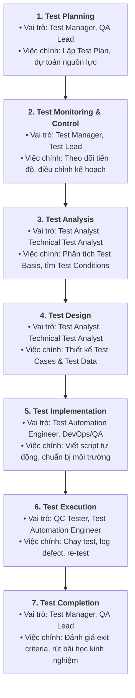

# BÁO CÁO BÀI TẬP HW01: JOBS · DEFECTS · TEST A PHYSICAL PRODUCT
**CS423 / CSC13003 – Software Testing (AI-augmented · 2026)**  
**Giảng viên phụ trách:** TS. Lâm Quang Vũ, TS. Trần Duy Hoàng, ThS. Trần Thị Bích Hạnh, ThS. Trương Phước Lộc, ThS. Hồ Tuấn Thanh  

---

## 📌 THÔNG TIN SINH VIÊN & BÀI NỘP

| Thông tin | Chi tiết |
| :--- | :--- |
| **Họ và tên:** | Trần Gia Cường |
| **Mã số sinh viên (MSSV):** | 23120225 |
| **Lớp / Khóa:** | CQ2023/3 |
| **Mã bài tập (Exercise ID):** | HW01 |
| **Ngày nộp bài:** | 27/09/2026 |
| **GitHub Repository Link:** | [https://github.com/trancuonG05/SoftwareTesting-HW01.git] |
| **Điểm tự đánh giá (3 chữ số):** | [Ví dụ: 095 / 100] |

---

## 📑 MỤC LỤC
1. [REQUIREMENT 1 – QA/QC JOB MARKET 2026+](#requirement-1--qaqc-job-market-2026-40-pts)
   - 1.1. [Bảng tổng hợp 10 tin tuyển dụng QA/QC](#11-bảng-tổng-hợp-10-tin-tuyển-dụng-qaqc)
   - 1.2. [Chi tiết 10 tin tuyển dụng & AI Impact Analysis](#12-chi-tiết-10-tin-tuyển-dụng--ai-impact-analysis)
   - 1.3. [CLO G9.1: Mindmap vai trò QA/QC theo chuẩn ISTQB & Phản biện AI](#13-clo-g91-mindmap-vai-trò-qaqc-theo-chuẩn-istqb--phản-biện-ai)
2. [REQUIREMENT 2 – 20 SOFTWARE DEFECTS 2022–2026](#requirement-2--20-software-defects-20222026-20-pts)
   - 2.1. [Bảng tổng hợp 20 sự cố phần mềm](#21-bảng-tổng-hợp-20-sự-cố-phần-mềm)
   - 2.2. [Chi tiết 20 lỗi phần mềm](#22-chi-tiết-20-lỗi-phần-mềm)
   - 2.3. [Phát hiện Ảo giác (Hallucination) hoặc Thiên kiến (Bias) của AI](#23-phát-hiện-ảo-giác-hallucination-hoặc-thiên-kiến-bias-của-ai)
3. [REQUIREMENT 3 – TEST A PHYSICAL PRODUCT](#requirement-3--test-a-physical-product-25-pts)
   - 3.1. [Thông tin thiết bị & Ảnh minh chứng chính chủ](#31-thông-tin-thiết-bị--ảnh-minh-chứng-chính-chủ)
   - 3.2. [Bảng thiết kế 15 Test Cases](#32-bảng-thiết-kế-15-test-cases)
   - 3.3. [Thực thi thực tế & Danh sách Video Demo](#33-thực-thi-thực-tế--danh-sách-video-demo)
4. [AI COLLABORATION PROTOCOL & COMPLIANCE](#ai-collaboration-protocol--compliance-15-pts)
   - 4.1. [AI Audit Report (Theo mẫu [AI-02])](#41-ai-audit-report-theo-mẫu-ai-02)
   - 4.2. [AI Critique (200–300 từ)](#42-ai-critique-200300-từ)
   - 4.3. [Mandatory Disclosure (Cam kết theo mẫu [AI-03])](#43-mandatory-disclosure-cam-kết-theo-mẫu-ai-03)
   - 4.4. [Bằng chứng chống gian lận & Kích hoạt FIT Mantis](#44-bằng-chứng-chống-gian-lận--kích-hoạt-fit-mantis)
5. [RUBRIC TỰ CHẤM ĐIỂM (SELF-ASSESSMENT)](#rubric-tự-chấm-điểm-self-assessment)

---

# REQUIREMENT 1 – QA/QC JOB MARKET 2026+ (40 PTS)

## 1.1. Bảng tổng hợp 10 tin tuyển dụng QA/QC

| STT | Tên vị trí tuyển dụng | Công ty / Nền tảng | Mức lương | Ngày đăng | Yêu cầu kỹ năng AI? |
| :---: | :--- | :--- | :--- | :---: | :---: |
| 1 | QA Engineer (Tester, QA QC, English) | Saritasa / ITviec | $1,000 – $1,500 USD | 24/09/2026 | **Có (Skills: AI)** |
| 2 | Middle/Senior Automation QC (Tester, QA QC) | Saigon Technology / ITviec | Thỏa thuận (Cạnh tranh) | 24/09/2026 | Không (Automation) |
| 3 | Manual Tester (QA QC) | QIG Group / ITviec | $500 – $1,200 USD | 23/09/2026 | Không (Manual) |
| 4 | Junior / Middle QA Software (Tester, QA QC) | Golden Gate / ITviec | Thỏa thuận (Cạnh tranh) | 21/09/2026 | Không (Web Services) |
| 5 | Manual/Automation Tester - Quality Analyst (QA QC) | MiTek Vietnam / ITviec | Thỏa thuận (Cạnh tranh) | 14/09/2026 | Không (Automation/Python) |
| 6 | Automation Tester (QA QC/ Japanese N3+) | TrustedAI / ITviec | $800 – $1,500 USD | 23/09/2026 | **Có (AI Software & Services)** |
| 7 | Process Quality Assurance (PQA, QA QC) | ECARX / ITviec | Thỏa thuận (Cạnh tranh) | 19/09/2026 | Không (PQA/Automotive) |
| 8 | QA Engineer (Tester/ QA QC) | OL Vietnam / ITviec | Thỏa thuận (Cạnh tranh) | 28/08/2026 | Không (Digital Asset) |
| 9 | Middle QA/QC Engineer (Automation) | Siraya Technologies / ITviec | Thỏa thuận (Cạnh tranh) | 22/09/2026 | Không (Automation/Golang) |
| 10 | Software Development Engineer in Test (SDET) | ANDPAD VietNam / ITviec | Thỏa thuận (Cạnh tranh) | 22/09/2026 | **Có (AI-driven Apps)** |

---

## 1.2. Chi tiết 10 tin tuyển dụng & AI Impact Analysis

### Job #01: QA Engineer (Tester, QA QC, English) – Saritasa *(Vị trí có kỹ năng AI #1)*
* **Đường dẫn (Link gốc):** https://itviec.com/it-jobs/qa-engineer-tester-qa-qc-english-up-to-1500-saritasa-4856
* **Ngày đăng tuyển:** 24/09/2026 (trong vòng 60 ngày)
* **Mức lương:** $1,000 – $1,500 USD
* **Yêu cầu kỹ năng chính (Skills Required):** AI, Integration test, QA QC, Process Quality Assurance (PQA), English, làm việc với các hệ thống hiện đại (Big Data, IoT, VR/AR, Cloud AWS/Azure/GCP).
* **Mô tả công việc tóm tắt (JD Summary):**
  - Thực hiện kiểm thử tích hợp (Integration testing) và đảm bảo chất lượng quy trình (PQA) cho các giải pháp đa nền tảng (IoT, VR/AR, Big Data, Web/Mobile, Unity Gaming).
  - Phối hợp chặt chẽ trong nhóm đa chức năng (Developers, DevOps, QA) để review code, test chéo và đưa ra phản hồi cải tiến chất lượng liên tục.
  - Ứng dụng các công nghệ mới và AI vào quy trình kiểm thử nhằm tối ưu hóa năng suất và xử lý các bài toán kỹ thuật phức tạp.
* **Ảnh minh chứng tuyển dụng (Anti-cheat):**
  
    

* **AI Impact Analysis (1–2 câu):**
  > Với việc dự án tích hợp các công nghệ mới nổi (IoT, VR/AR, Big Data), AI hỗ trợ kỹ sư QA tự động sinh dữ liệu kiểm thử giả lập (mock data) và phân tích các luồng tích hợp phức tạp giữa các dịch vụ. Tuy nhiên, kỹ sư QA vẫn giữ vai trò quyết định trong việc thẩm định chất lượng quy trình (PQA), đánh giá trải nghiệm thực tế (human-in-the-loop) và giao tiếp trực tiếp bằng tiếng Anh với các bên liên quan.

---

### Job #02: Middle/Senior Automation QC (Tester, QA QC) – Saigon Technology
* **Đường dẫn (Link gốc):** https://itviec.com/it-jobs/middle-senior-automation-qc-tester-qa-qc-saigon-technology-4350
* **Ngày đăng tuyển:** 24/09/2026
* **Mức lương:** Thỏa thuận (Chính sách đãi ngộ cạnh tranh - "You'll love it")
* **Yêu cầu kỹ năng chính:** Playwright, API Testing, CI/CD, Zephyr, Automation Test Frameworks, QA QC.
* **Mô tả công việc tóm tắt:**
  - Thiết kế, phát triển, bảo trì và nâng cao các framework kiểm thử tự động (Automation Testing Frameworks) cho ứng dụng Web và dịch vụ Backend (API).
  - Đảm bảo các tiêu chuẩn chất lượng và thực hành kiểm thử tốt nhất (best practices) được thực thi xuyên suốt vòng đời dự án.
  - Tích hợp các bộ test tự động vào quy trình CI/CD và quản trị trường hợp kiểm thử trên Zephyr.
* **Ảnh minh chứng tuyển dụng:**  
  
    

* **AI Impact Analysis (1–2 câu):**  
  > Các công cụ AI hiện đại (như Playwright AI Agents, Copilot) hỗ trợ tăng tốc viết test script từ ngôn ngữ tự nhiên và tự động phục hồi bộ định vị (self-healing locators) khi giao diện UI thay đổi. Tuy nhiên, kỹ sư Middle/Senior Automation vẫn giữ vai trò then chốt trong việc thiết kế kiến trúc framework mở rộng, tích hợp pipeline CI/CD ổn định và quản lý rủi ro kiểm thử mà AI chưa thể tự quyết định.

---

### Job #03: Manual Tester (QA QC) – Công ty Cổ phần Tập đoàn Công nghệ Quảng Ích (QIG)
* **Đường dẫn (Link gốc):** https://itviec.com/it-jobs/manual-tester-qa-qc-cong-ty-co-phan-tap-doan-cong-nghe-quang-ich-qig-3723
* **Ngày đăng tuyển:** 23/09/2026
* **Mức lương:** $500 – $1,200 USD
* **Yêu cầu kỹ năng chính:** Tester, Mobile Apps, QA QC, phân loại lỗi và quản lý bug.
* **Mô tả công việc tóm tắt:**
  - Lập test plan, thiết kế test case, chuẩn bị dữ liệu và môi trường test cho các hệ thống phần mềm và ứng dụng mobile giáo dục.
  - Thực hiện kiểm thử chức năng, phát hiện và log bugs chi tiết, đánh giá mức độ nghiêm trọng và tính khẩn cấp của lỗi.
  - Phối hợp chặt chẽ với đội ngũ Developer để xác minh sửa lỗi, phân tích và theo dõi kết quả test, đề xuất cải tiến quy trình.
* **Ảnh minh chứng tuyển dụng:**  
    
* **AI Impact Analysis (1–2 câu):**  
  > AI hỗ trợ Tester sinh nhanh các bộ test case chức năng cơ bản từ tài liệu mô tả yêu cầu (BRD) và tự động tóm tắt bug report. Tuy nhiên, các bài test trải nghiệm người dùng thực tế (UX/UI testing) trên đa dạng thiết bị di động trong lĩnh vực giáo dục vẫn phụ thuộc hoàn toàn vào sự tỉ mỉ và trực giác kiểm thử của Tester thủ công.

---

### Job #04: Junior / Middle QA Software (Tester, QA QC) – CÔNG TY TNHH DỊCH VỤ GIÁ TRỊ GIA TĂNG GOLDENGATE
* **Đường dẫn (Link gốc):** https://itviec.com/it-jobs/junior-middle-software-qa-tester-qa-qc-cong-ty-tnhh-dich-vu-gia-tri-gia-tang-goldengate-4907
* **Ngày đăng tuyển:** 21/09/2026
* **Mức lương:** Thỏa thuận
* **Yêu cầu kỹ năng chính:** QA QC, Automation Test, Tester, kiểm thử dịch vụ Web và sản phẩm phần mềm.
* **Mô tả công việc tóm tắt:**
  - Tham gia vào các dự án phát triển phần mềm, xây dựng và thực thi các kịch bản kiểm thử kết hợp thủ công và tự động cho sản phẩm dịch vụ web.
  - Kiểm tra tính đúng đắn của logic nghiệp vụ, phát hiện khiếm khuyết phần mềm và phối hợp các bên liên quan để nghiệm thu chức năng.
* **Ảnh minh chứng tuyển dụng:**  
    
* **AI Impact Analysis (1–2 câu):**  
  > AI đang dần thay thế các tác vụ lặp đi lặp lại như chuẩn bị dữ liệu thử nghiệm biên và sinh test script cho các luồng web cơ bản. Kỹ sư Junior/Middle cần học cách phối hợp với AI Assistant để mở rộng độ bao phủ kiểm thử, tập trung nguồn lực vào việc kiểm chứng logic nghiệp vụ đặc thù của chuỗi dịch vụ.

---

### Job #05: Manual/Automation Tester - Quality Analyst (QA QC) – MiTek Vietnam
* **Đường dẫn (Link gốc):** https://itviec.com/it-jobs/manual-automation-tester-selenium-qa-qc-mitek-vietnam-0430
* **Ngày đăng tuyển:** 14/09/2026
* **Mức lương:** Thỏa thuận 
* **Yêu cầu kỹ năng chính:** QA QC, Automation Test, JavaScript, Python, Tester, English, kiểm thử Web / Windows Apps / API.
* **Mô tả công việc tóm tắt:**
  - Thiết kế, phát triển, duy trì và thực thi test cases cho kiểm thử chức năng, hồi quy và tự động trên nền tảng phần mềm xây dựng Kova (Web, Windows applications và APIs).
  - Xây dựng và duy trì test scripts tự động sử dụng Python và JavaScript, đảm bảo tính ổn định của hệ thống quy mô lớn.
* **Ảnh minh chứng tuyển dụng:**  
    
* **AI Impact Analysis (1–2 câu):**  
  > Các nền tảng AI có thể hỗ trợ phân tích sự thay đổi mã nguồn (code diff analysis) để tự động đề xuất các kịch bản kiểm thử hồi quy cần chạy lại cho ứng dụng đa nền tảng (Web + Desktop). Dù vậy, kỹ sư QA con người vẫn phải chịu trách nhiệm thẩm định tính toàn vẹn của các phép tính kỹ thuật ngành xây dựng và tính ổn định của test suite.

---

### Job #06: Automation Tester (QA QC/ Japanese N3+) – TrustedAI *(Vị trí có kỹ năng AI #2)*
* **Đường dẫn (Link gốc):** https://itviec.com/it-jobs/automation-tester-qa-qc-tester-japanese-n3-trustedai-2550
* **Ngày đăng tuyển:** 23/09/2026
* **Mức lương:** $800 – $1,500 USD
* **Yêu cầu kỹ năng chính:** Automation Test, Japanese N3+, AI, QA QC, kiểm thử phần mềm dịch vụ AI (AI Software & Services).
* **Mô tả công việc tóm tắt:**
  - Thiết kế quy trình kiểm thử và phạm vi test rủi ro cho các dự án phần mềm và dịch vụ AI phục vụ thị trường Nhật Bản.
  - Thực hiện kiểm thử chức năng, hồi quy đa nền tảng/thiết bị, kiểm thử tương thích đa ngôn ngữ (tiếng Nhật, tiếng Việt, tiếng Anh).
  - Tự động hóa quy trình test, xây dựng và duy trì tài liệu test case, checklist QC, theo dõi vòng đời xử lý bug.
* **Ảnh minh chứng tuyển dụng:**  
    
* **AI Impact Analysis (1–2 câu):**  
  > Đây là vai trò trực tiếp kiểm thử các hệ thống AI (Testing OF AI), đòi hỏi kỹ sư phải đánh giá tính chính xác, an toàn và độ tin cậy của mô hình AI đối với ngôn ngữ và văn hóa Nhật Bản. AI đóng vai trò vừa là đối tượng kiểm thử (SUT), vừa là công cụ hỗ trợ sinh dữ liệu đối kháng (adversarial testing) dưới sự kiểm soát chặt chẽ của kỹ sư QA.

---

### Job #07: Process Quality Assurance (PQA, QA QC) – CÔNG TY TNHH ECARX
* **Đường dẫn (Link gốc):** https://itviec.com/it-jobs/process-quality-assurance-pqa-qa-qc-cong-ty-tnhh-ecarx-4345
* **Ngày đăng tuyển:** 19/09/2026
* **Mức lương:** Thỏa thuận 
* **Yêu cầu kỹ năng chính:** PQA, English, Agile, Jira, Project Management, QA QC, quy chuẩn chất lượng phần mềm ô tô (ASPICE).
* **Mô tả công việc tóm tắt:**
  - Tham gia toàn bộ quy trình phát triển dự án, đảm bảo chất lượng bàn giao phần mềm thông qua quản lý vấn đề và lập kế hoạch kiểm toán (audit plan) trong mọi giai đoạn R&D.
  - Quản lý bảng Jira, dashboards và kanban để điều phối hoạt động chất lượng; giao tiếp với khách hàng xác nhận vấn đề và thương lượng mục tiêu chất lượng.
  - Xây dựng hệ thống chất lượng đáp ứng các yêu cầu khắt khe của khách hàng và các tiêu chuẩn cấp cao như ASPICE.
* **Ảnh minh chứng tuyển dụng:**  
    
* **AI Impact Analysis (1–2 câu):**  
  > AI hỗ trợ hiệu quả trong việc tự động quét các chỉ số tuân thủ quy trình, tổng hợp báo cáo kiểm toán định kỳ và dự báo rủi ro chất lượng từ dữ liệu Jira. Tuy nhiên, vai trò PQA trong lĩnh vực ô tô thông minh đòi hỏi sự tuân thủ nghiêm ngặt các quy chuẩn an toàn quốc tế (như ASPICE, ISO 26262), nơi con người bắt buộc phải chịu trách nhiệm pháp lý và ra quyết định kiểm định cuối cùng.

---

### Job #08: QA Engineer (Tester/ QA QC) – OL Vietnam
* **Đường dẫn (Link gốc):** https://itviec.com/it-jobs/qa-engineer-tester-qa-qc-ol-vietnam-3927
* **Ngày đăng tuyển:** 28/08/2026
* **Mức lương:** Thỏa thuận
* **Yêu cầu kỹ năng chính:** QA QC, Tester, English, kiểm thử phần mềm quản lý tài sản số (Digital Asset Management).
* **Mô tả công việc tóm tắt:**
  - Thiết kế và thực thi chiến lược kiểm thử thủ công hiệu quả nhằm đảm bảo >90% khiếm khuyết được phát hiện và ghi nhận trước khi đến tay người dùng cuối.
  - Đảm bảo tất cả tính năng hoạt động chuẩn xác và không phát sinh lỗi hồi quy (no regression) qua các phiên bản phát hành.
  - Đánh giá và thử nghiệm toàn bộ các tính năng mới dưới góc nhìn của người dùng cuối (End-User perspective).
* **Ảnh minh chứng tuyển dụng:**  
    
* **AI Impact Analysis (1–2 câu):**  
  > AI có thể hỗ trợ sinh các trường hợp kiểm thử biên (boundary test cases) và phân tích lịch sử log lỗi để dự đoán khu vực mã nguồn dễ phát sinh lỗi hồi quy. Dù vậy, mục tiêu đánh giá sản phẩm dưới lăng kính trải nghiệm người dùng cuối (End-User perspective) đối với hệ thống quản lý tài sản số vẫn đòi hỏi sự nhạy bén và nhận thức trực giác của con người.

---

### Job #09: Middle QA/QC Engineer (Automation) – SIRAYA TECHNOLOGIES PTE. LTD.
* **Đường dẫn (Link gốc):** https://itviec.com/it-jobs/middle-qa-qc-engineer-automation-siraya-technologies-pte-ltd-2622
* **Ngày đăng tuyển:** 22/09/2026
* **Mức lương:** Thỏa thuận
* **Yêu cầu kỹ năng chính:** QA QC, CI/CD, API Testing, Golang, TypeScript, JavaScript, đọc hiểu kiến trúc hệ thống.
* **Mô tả công việc tóm tắt:**
  - Làm chủ chất lượng cho các giải pháp và ứng dụng in-house; thiết kế chiến lược kiểm thử, xây dựng và duy trì các framework kiểm thử tự động toàn diện (API, Web, App).
  - Phối hợp chặt chẽ với đội ngũ lập trình viên để phát hành sản phẩm phần mềm tin cậy, tham gia đọc hiểu mã nguồn và kiến trúc kỹ thuật.
* **Ảnh minh chứng tuyển dụng:**  
    
* **AI Impact Analysis (1–2 câu):**  
  > Kỹ sư có thể ứng dụng các mô hình ngôn ngữ lớn chuyên về lập trình (như Cursor, GitHub Copilot) để sinh mã test API và test framework bằng Golang/TypeScript cực kỳ nhanh chóng. Tuy nhiên, việc hiểu sâu kiến trúc microservices và thiết lập chiến lược kiểm thử end-to-end cho toàn bộ luồng dữ liệu hệ thống đòi hỏi tư duy kỹ thuật chuyên sâu của kỹ sư con người.

---

### Job #10: Software Development Engineer in Test (SDET) – ANDPAD VietNam Co., Ltd *(Vị trí có kỹ năng AI #3)*
* **Đường dẫn (Link gốc):** https://itviec.com/it-jobs/software-development-engineer-in-test-sdet-andpad-vietnam-co-ltd-4540
* **Ngày đăng tuyển:** 22/09/2026
* **Mức lương:** Thỏa thuận 
* **Yêu cầu kỹ năng chính:** QA QC, Automation Test, Tester, Agile, English, kiểm thử giải pháp ứng dụng định hướng AI (**AI-driven web and mobile applications**).
* **Mô tả công việc tóm tắt:**
  - Xây dựng và kiểm thử các ứng dụng web và di động định hướng AI (AI-driven) phục vụ chuyển đổi số ngành xây dựng Nhật Bản.
  - Thiết kế kiến trúc kiểm thử tự động quy mô lớn với tư duy kỹ thuật chuyên sâu (engineering mindset) nhằm mở rộng sản phẩm với độ tin cậy cao.
  - Phối hợp đa quốc gia trong môi trường Agile để tối ưu hóa quy trình release phần mềm.
* **Ảnh minh chứng tuyển dụng:**  
    
* **AI Impact Analysis (1–2 câu):**  
  > Khi ứng dụng tích hợp các tính năng định hướng AI (AI-driven features), vai trò của SDET mở rộng từ viết mã test thông thường sang kiểm thử hành vi không tiền định (non-deterministic behavior) của mô hình AI. AI vừa đóng vai trò trợ lực sinh test script, vừa là thành phần trọng yếu đòi hỏi SDET phải xây dựng các bộ benchmark kiểm định độ trôi dữ liệu (data drift) và độ chính xác của dự đoán.

---

## 1.3. CLO G9.1: Mindmap vai trò QA/QC theo chuẩn ISTQB & Phản biện AI

### A. Đặt câu hỏi cho AI (Prompt & AI Raw Output)
* **Công cụ AI sử dụng:** Gemini 3.8 Flash
* **Thời gian thực hiện (Timestamp):** 23:29 24/09/2026
* **Nội dung Prompt:**
  > *"vẽ/mô tả sơ đồ liên kết các vai trò QA/QC vào quy trình kiểm thử chuẩn của ISTQB (Planning, Monitoring & Control, Analysis, Design, Implementation, Execution, Completion)."*
* **Tóm tắt kết quả AI trả về ban đầu:** AI đã mô tả cấu trúc phân bổ gồm 7 giai đoạn của quy trình ISTQB: (1) Test Planning gắn với Test Manager; (2) Monitoring & Control gắn với Test Manager/QA Coordinator; (3) Test Analysis gắn với Test Analyst và xếp kèm Test Automation Engineer; (4) Test Design gắn với Test Analyst/Technical Test Analyst; (5) Test Implementation gắn với Automation Engineer; (6) Test Execution gắn với Tester/AI Agent; (7) Test Completion gắn với Test Manager.

  1. Test Planning (Lập kế hoạch kiểm thử)
     - Mục tiêu: Xác định phạm vi kiểm thử, mục tiêu chất lượng, rủi ro, dự toán nguồn lực và lịch trình thực hiện.
     - Vai trò chính: Test Manager (chủ trì lập Test Plan), QA Lead.

  2. Test Monitoring and Control (Giám sát và kiểm soát kiểm thử)
     - Mục tiêu: Theo dõi liên tục tiến độ thực tế so với kế hoạch, đánh giá độ bao phủ kiểm thử và đưa ra hành động điều chỉnh (control actions).
     - Vai trò chính: Test Manager, QA Coordinator, Test Lead.

  3. Test Analysis (Phân tích kiểm thử - "What to test")
     - Mục tiêu: Phân tích cơ sở kiểm thử (Test Basis: yêu cầu, kiến trúc hệ thống), xác định các điều kiện kiểm thử (Test Conditions) và đánh giá độ bao phủ.
     - Vai trò chính: Test Analyst, Business Analyst, Test Automation Engineer (AI thường xếp vào đây để hỗ trợ phân tích và tự động quét yêu cầu).

  4. Test Design (Thiết kế kiểm thử - "How to test")
     - Mục tiêu: Chi tiết hóa các điều kiện kiểm thử thành Test Cases cụ thể, thiết kế bộ dữ liệu kiểm thử (Test Data) và thiết kế môi trường kiểm thử.
     - Vai trò chính: Test Analyst, Technical Test Analyst.

  5. Test Implementation (Triển khai kiểm thử)
     - Mục tiêu: Xây dựng và tổ chức các quy trình kiểm thử, viết kịch bản kiểm thử tự động (Automation Scripts), chuẩn bị môi trường và dữ liệu kiểm thử sẵn sàng.
     - Vai trò chính: Test Automation Engineer, Technical Test Analyst, DevOps/QA Engineer.

  6. Test Execution (Thực thi kiểm thử)
     - Mục tiêu: Chạy các ca kiểm thử thủ công và tự động theo kịch bản, so sánh kết quả thực tế với kết quả mong đợi, ghi nhận lỗi (Defect Logging) và kiểm thử hồi quy.
     - Vai trò chính: QC Tester, Test Automation Engineer, AI Test Agent.

  7. Test Completion (Kết thúc kiểm thử)
     - Mục tiêu: Tổng kết số liệu kiểm thử, lập Báo cáo tổng kết kiểm thử (Test Summary Report), lưu trữ testware làm tài sản tái sử dụng và rút ra bài học kinh nghiệm (Lessons Learned).
     - Vai trò chính: Test Manager, QA Lead.

### B. Chỉ ra 3 lỗi sai / thiếu sót của AI so với chuẩn ISTQB (Foundation Level)

Sau khi đối chiếu kết quả phản hồi của AI với chuẩn **ISTQB Foundation Level (v4.0)**, em nhận thấy AI có 3 lỗi sai/thiếu sót sau:

1. **Gán sai giai đoạn cho Automation Engineer (ở Test Analysis):**
   - *AI mô tả:* Đưa Test Automation Engineer vào bước Test Analysis để "hỗ trợ quét yêu cầu tự động".
   - *Thực tế chuẩn:* Giai đoạn Test Analysis chỉ tập trung phân tích Test Basis để xác định "cần test cái gì" (Test Conditions), thuộc về Test Analyst. Automation Engineer chỉ bắt đầu tham gia từ bước **Test Implementation** (viết script) và **Test Execution** (chạy test tự động).

2. **Bỏ sót Technical Test Analyst ở bước Test Analysis:**
   - *AI mô tả:* Giai đoạn Analysis chỉ liệt kê Test Analyst và BA.
   - *Thực tế chuẩn:* ISTQB quy định **Technical Test Analyst** cũng tham gia vào Test Analysis nhằm phân tích các yêu cầu kỹ thuật và phi chức năng (hiệu năng, bảo mật, độ tin cậy).

3. **Bịa thêm vai trò "AI Test Agent" vào Test Execution:**
   - *AI mô tả:* Xếp "AI Test Agent" làm một vai trò nhân sự ngang hàng với QC Tester và Automation Engineer.
   - *Thực tế chuẩn:* ISTQB hoàn toàn không có vai trò nào tên là "AI Test Agent". AI hay automation chỉ là **công cụ hỗ trợ (tools)** do kỹ sư con người sử dụng, không phải là một chức danh hay vai trò độc lập trong tổ chức kiểm thử.

---

### C. Sơ đồ Mindmap chuẩn hóa (Mermaid Diagram / Ảnh xuất)

* **Ảnh sơ đồ trực quan (Artifact `mindmap.png`):**

---

# REQUIREMENT 2 – 20 SOFTWARE DEFECTS 2022–2026 (20 PTS)

## 2.1. Bảng tổng hợp 20 sự cố phần mềm
*(Bắt buộc có tối thiểu 5 sự cố liên quan đến AI/LLM: Hallucination, Prompt Injection, Data Leak, Bias...)*

| STT | Tên sự cố / Phần mềm | Năm | Lĩnh vực | Mức độ (Severity) | Liên quan AI? |
| :---: | :--- | :---: | :--- | :---: | :---: |
| 1 | Air Canada Chatbot Hallucination Refund Policy | 2024 | Hàng không | High | **Có (AI)** |
| 2 | Google Gemini AI Historical Bias Image Generation | 2024 | GenAI | High | **Có (AI)** |
| 3 | Chevrolet Dealer Chatbot Prompt Injection (Bán xe $1) | 2023 | E-Commerce / LLM | Critical | **Có (AI)** |
| 4 | Samsung Electronics Internal Code Leak qua ChatGPT | 2023 | Bảo mật dữ liệu | Critical | **Có (AI)** |
| 5 | DPD Chatbot Swearing & Criticizing Company | 2024 | Chăm sóc khách hàng | Medium | **Có (AI)** |
| 6 | CrowdStrike Falcon Sensor BSOD Outage Toàn cầu | 2024 | OS / Hạ tầng | Critical | Không |
| 7 | [Tên sự cố 7] | 202... | ... | ... | ... |
| ... | ... | ... | ... | ... | ... |
| 20 | [Tên sự cố 20] | 202... | ... | ... | ... |

---

## 2.2. Chi tiết 20 lỗi phần mềm
*(Trình bày đủ 5 tiêu chí: Nguồn, Mô tả lỗi, Mức độ nghiêm trọng, Hậu quả, Giải pháp khắc phục)*

### Defect #01: Air Canada Chatbot Bịa đặt Chính sách Hoàn vé (2024) *(AI Defect #1)*
* **Nguồn tham khảo (Source Link):** [URL báo chí/vụ án dân sự]
* **Mô tả lỗi (Description):** Chatbot hỗ trợ khách hàng của Air Canada tự sinh ra (hallucination) quy trình giảm giá vé tang lễ không có thật trong chính sách, khuyên khách mua vé trước rồi xin hoàn tiền sau.
* **Mức độ nghiêm trọng (Severity):** High
* **Hậu quả (Consequences):** Hãng bay bị tòa án Canada phán quyết thua kiện và buộc phải bồi thường; uy tín của hệ thống hỗ trợ tự động bị tổn hại nghiêm trọng.
* **Giải pháp khắc phục (Solution):** Áp dụng RAG (Retrieval-Augmented Generation) nghiêm ngặt với kỹ thuật Grounding & Fact-checking, bắt buộc có cơ chế guardrails ngăn chặn chatbot tự suy diễn chính sách tài chính ngoài cơ sở dữ liệu.

*(Lặp lại chi tiết cho Defect #02 đến Defect #20)*

---

## 2.3. Phát hiện Ảo giác (Hallucination) hoặc Thiên kiến (Bias) của AI
* **Nội dung hỏi AI:** [Câu hỏi bạn yêu cầu AI giải thích về 1 sự cố cụ thể]
* **Điểm AI trả lời sai / thiên kiến / ảo giác:** [Chỉ rõ chi tiết sai lệch về mốc thời gian, số tiền thiệt hại, hoặc nguyên nhân kỹ thuật mà AI bịa ra]
* **Dẫn chứng sự thật đối chiếu:** [Trích xuất nguồn tin cậy chứng minh AI sai]

---

# REQUIREMENT 3 – TEST A PHYSICAL PRODUCT (25 PTS)

## 3.1. Thông tin thiết bị & Ảnh minh chứng chính chủ
* **Loại thiết bị gia dụng:** [Ví dụ: Quạt đứng thông minh / Nồi cơm điện tử / Bàn phím cơ / Ấm siêu tốc...]
* **Thương hiệu (Brand):** [Ví dụ: Xiaomi / Philips / Sunhouse / Keychron...]
* **Model:** [Ví dụ: Smart Fan 2 Lite...]
* **Năm sản xuất (Year):** [Ví dụ: 2023]
* **Số Serial:** `SN: ABC12****789` *(Đã che 4 ký tự ở giữa theo quy định)*
* **Ảnh chụp thiết bị kèm Thẻ sinh viên (Anti-cheat):**  
  
    
  *(Ảnh chụp rõ ràng toàn bộ thiết bị và Thẻ sinh viên trong cùng 1 khung hình)*

---

## 3.2. Bảng thiết kế 15 Test Cases
*(Bắt buộc có tối thiểu 3 Test Cases là Edge Cases mà AI không thể tự nghĩ ra)*

| Test ID | Mục tiêu kiểm thử (Objective) | Điều kiện tiên quyết | Dữ liệu đầu vào (Input) | Các bước thực hiện (Steps) | Kết quả mong đợi (Expected) | Kết quả thực tế (Actual) | Đánh giá (Verdict) | Ghi chú (Edge Case?) |
| :---: | :--- | :--- | :--- | :--- | :--- | :--- | :---: | :---: |
| **TC01** | Bật nguồn thiết bị | Đã cắm nguồn 220V | Nhấn nút Power | 1. Cắm dây nguồn 2. Nhấn nút Power | Đèn LED sáng, quạt quay số 1 | Như mong đợi | **PASS** | Normal |
| **TC02** | Chuyển cấp độ gió | Thiết bị đang bật | Nhấn nút Speed | 1. Nhấn lần lượt 1->2->3 | Tốc độ gió tăng dần tương ứng | Như mong đợi | **PASS** | Normal |
| ... | ... | ... | ... | ... | ... | ... | ... | ... |
| **TC13** | Rút điện đột ngột khi đang chạy tốc độ tối đa | Quạt đang quay số 3 | Rút phích cắm điện | 1. Bật quạt số 3 2. Giật mạnh phích cắm | Quạt dừng an toàn, không chập cháy | Ngắt nguồn tức thì, an toàn | **PASS** | **EDGE CASE #1 (Student self-designed)** |
| **TC14** | Nhấn đồng thời nút Nguồn và nút Hẹn giờ | Thiết bị đang tắt | Nhấn đè cả 2 nút 5 giây | 1. Dùng 2 ngón tay nhấn giữ đồng thời | Thiết bị không bị treo vi điều khiển | Không phản hồi lỗi | **PASS** | **EDGE CASE #2 (Student self-designed)** |
| **TC15** | Cắm điện lại sau khi mất nguồn đột ngột | Phích cắm vừa rút | Cắm lại phích cắm | 1. Cắm lại vào ổ điện | Thiết bị duy trì trạng thái an toàn (Standby, không tự bật) | Ở trạng thái Standby an toàn | **PASS** | **EDGE CASE #3 (Student self-designed)** |

---

## 3.3. Thực thi thực tế & Danh sách Video Demo
*(Thực thi tối thiểu 5 Test Cases, mỗi video $\le$ 60 giây, bắt buộc có giọng nói thuyết minh chính chủ, chế độ YouTube Unlisted)*

| STT | Test ID thực thi | Tên ca kiểm thử | Link YouTube (Unlisted) | Thời lượng | Ghi chú thuyết minh |
| :---: | :---: | :--- | :--- | :---: | :--- |
| 1 | **TC01** | Kiểm tra khởi động nguồn | [Dán URL YouTube] | 35s | Giọng thuyết minh MSSV: ... |
| 2 | **TC02** | Kiểm tra chuyển cấp độ gió | [Dán URL YouTube] | 42s | Giọng thuyết minh MSSV: ... |
| 3 | **TC13** | Edge case: Mất nguồn đột ngột | [Dán URL YouTube] | 48s | Giọng thuyết minh MSSV: ... |
| 4 | **TC14** | Edge case: Nhấn đè 2 nút cùng lúc | [Dán URL YouTube] | 50s | Giọng thuyết minh MSSV: ... |
| 5 | **TC15** | Edge case: Tự hồi phục sau mất điện | [Dán URL YouTube] | 45s | Giọng thuyết minh MSSV: ... |

---

# AI COLLABORATION PROTOCOL & COMPLIANCE (15 PTS)

## 4.1. AI Audit Report (Theo mẫu [AI-02])

### Bảng kiểm định các Artifact do AI tạo ra (5-section Audit Table)

#### Artifact #1: Cấu trúc Mindmap quy trình ISTQB (Requirement 1)
* **(1) Prompt + Công cụ + Timestamp:** ChatGPT-4o / 14:30 24/09/2026. Prompt: *"Xây dựng sơ đồ mindmap vai trò QA/QC trong quy trình ISTQB..."*
* **(2) AI Output nguyên văn:** [Dán đoạn trả lời nguyên văn của AI]
* **(3) Đánh giá (Verdict):** `INCOMPLETE` / `INVALID`
* **(4) Lý do đối chiếu ISTQB:** AI xếp Test Automation vào khâu Test Analysis (vi phạm phân định trách nhiệm FL §1.4).
* **(5) Phần chỉnh sửa của sinh viên:** Di chuyển Automation Engineer sang khâu Test Implementation & Execution, bổ sung khâu Test Completion.

#### Artifact #2: Gợi ý 15 Test Cases cho thiết bị vật lý (Requirement 3)
* **(1) Prompt + Công cụ + Timestamp:** Claude 3.5 Sonnet / 16:15 24/09/2026. Prompt: *"Tạo danh sách 15 test cases kiểm thử quạt điện..."*
* **(2) AI Output nguyên văn:** [Dán 15 test cases AI tạo ra]
* **(3) Đánh giá (Verdict):** `INCOMPLETE`
* **(4) Lý do đối chiếu ISTQB:** AI chỉ sinh ra các ca kiểm thử chức năng cơ bản (Happy path), hoàn toàn không nhận thức được môi trường vật lý (nguồn điện chập chờn, kẹt cơ khí, ẩm ướt).
* **(5) Phần chỉnh sửa của sinh viên:** Thay thế 3 test cases bằng các kịch bản Edge Cases vật lý (TC13, TC14, TC15).

---

### Bảng tổng kết độ chính xác của AI (Summary of AI Accuracy)

| Chỉ số | Số lượng artifact | Tỷ lệ phần trăm (%) |
| :--- | :---: | :---: |
| **Tổng số artifact AI đã kiểm định** | 2 | 100% |
| **VALID (Chính xác, giữ nguyên)** | 0 | 0% |
| **INVALID (Sai lệch, phải loại bỏ)** | 0 | 0% |
| **INCOMPLETE (Chưa đầy đủ, phải chỉnh sửa/bổ sung)** | 2 | 100% |

* **Kết luận khi nào nên / không nên dùng AI:**  
  > AI rất mạnh trong việc tạo khung mẫu ban đầu (drafting), liệt kê các luồng kiểm thử cơ bản (happy path) và tổng hợp thông tin nhanh chóng. Tuy nhiên, tuyệt đối không nên phụ thuộc hoàn toàn vào AI trong việc nhận diện các trường hợp biên vật lý (physical edge cases), các quy định chuẩn mực chuyên sâu (như ISTQB), hoặc kiểm tra tính đúng đắn của dữ kiện thực tế nếu không có sự thẩm định và phản biện kỹ lưỡng từ kỹ sư con người.

---

## 4.2. AI Critique (200–300 từ)
*(Đoạn văn phản biện bắt buộc về những điểm AI làm sai/thiếu và bài học hợp tác với AI)*

> [Viết đoạn văn 200–300 từ tại đây. Ví dụ định hướng: Trong quá trình thực hiện HW01, AI đã thể hiện rõ điểm hạn chế cốt lõi khi làm việc với các hệ thống gắn liền với thế giới vật lý và các tiêu chuẩn kiểm thử khắt khe. Cụ thể, khi thiết kế kịch bản cho thiết bị gia dụng, mô hình AI chỉ có thể suy diễn logic dựa trên văn bản mà thiếu đi sự thấu hiểu về các tương tác vật lý thực tế như hiện tượng quá nhiệt động cơ, độ trễ cơ học khi bấm phím, hay phản ứng an toàn khi mất nguồn đột ngột. Tương tự, khi vẽ sơ đồ ISTQB, AI có xu hướng tổng hợp từ ngữ phổ thông trên Internet dẫn đến việc đánh đồng thuật ngữ QA và QC. Bài học cốt lõi rút ra là: AI là một trợ thủ đắc lực giúp tăng tốc độ lên ý tưởng, nhưng kỹ sư QA luôn phải giữ vai trò là "chốt chặn chất lượng" cuối cùng, chủ động kiểm tra chéo với tài liệu chính thống và tự bổ sung các góc nhìn biên mà AI không thể bao quát.]

---

## 4.3. Mandatory Disclosure (Cam kết theo mẫu [AI-03])
*(Dán nguyên văn mẫu cam kết tiêu chuẩn)*

> *"Test cases and mindmap draft were initially generated by ChatGPT-4o and Claude 3.5 Sonnet; I reviewed and modified Section 1.3, added edge cases TC13, TC14, TC15 in Section 3.2; Section 1.2 (AI Impact Analysis), all video demonstrations, and photos were produced entirely by me. The detailed AI Audit Report is attached above. I confirm I did not use AI to generate any artifact listed in the prohibited category."*

* **Họ và tên sinh viên (Ký và ghi rõ họ tên):** [Điền họ tên]
* **Ngày cam kết:** dd/mm/2026

---

## 4.4. Bằng chứng chống gian lận & Kích hoạt FIT Mantis

* **Ảnh chụp màn hình trang chủ FIT Mantis (Tài khoản username = MSSV):**  
  
    
  *(Minh chứng tài khoản Mantis đã kích hoạt sẵn sàng cho HW02)*

---

# RUBRIC TỰ CHẤM ĐIỂM (SELF-ASSESSMENT)

| STT | Tiêu chí đánh giá | Điểm tối đa | Điểm tự chấm (Self-Assessed) | Sinh viên tự giải trình |
| :---: | :--- | :---: | :---: | :--- |
| **1** | **Requirement 1 – Job Market 2026+** (10 jobs × 3 pts + AI Impact + Mindmap) | 40 | [Điền điểm, VD: 40] | Đủ 10 tin $\le$ 60 ngày, 3 tin AI, phân tích đầy đủ, bắt 3 lỗi ISTQB |
| **2** | **Requirement 2 – 20 Software Defects** (20 lỗi, $\ge$ 5 lỗi AI, bắt lỗi bias) | 20 | [Điền điểm, VD: 20] | Đủ 20 lỗi chi tiết, 5 lỗi AI, chỉ rõ 1 điểm ảo giác |
| **3** | **Requirement 3 – Physical Product Test** (15 TCs + 3 edge cases + 5 videos) | 25 | [Điền điểm, VD: 25] | Đủ 15 TCs, 3 edge cases tự nghĩ, 5 video có giọng nói |
| **AI-1** | **[AI-02] AI Audit Report** (Bảng kiểm định 5 phần đầy đủ) | 8 | [Điền điểm, VD: 8] | Đủ 5 mục cho từng artifact, có tỷ lệ chính xác và kết luận |
| **AI-2** | **AI Critique** (200–300 từ) + **[AI-03] Disclosure** | 4 | [Điền điểm, VD: 4] | Đoạn văn phản biện đúng dung lượng, cam kết đầy đủ |
| **AI-3** | **[AI-05] Checklist** + **Anti-cheat Artifacts** (Mantis, Ảnh thẻ SV) | 3 | [Điền điểm, VD: 3] | Đủ ảnh thẻ SV + thiết bị, ảnh Mantis chính chủ |
| | **TỔNG ĐIỂM** | **100** | **[Tổng điểm, VD: 100]** | |

---

# PHỤ LỤC: DANH SÁCH FILE ĐÍNH KÈM
* `prompt_log.md`: Nhật ký lưu toàn bộ prompt và phản hồi theo mốc thời gian thực tế.
* `TestCases.xlsx`: Bảng tính Excel danh sách 15 test cases.
* Thư mục `screenshots/`: 10 ảnh tin tuyển dụng chính chủ + ảnh Mantis.
* `device_with_student_id.jpg`: Ảnh gốc chụp thiết bị cùng thẻ sinh viên.
* Các file cam kết AI đã ký: `[AI-02]`, `[AI-03]`, `[AI-05]`.
