# BÁO CÁO BÀI TẬP HW01: JOBS · DEFECTS · TEST A PHYSICAL PRODUCT
**CS423 / CSC13003 – Software Testing (AI-augmented · 2026)**  
**Giảng viên phụ trách:** TS. Lâm Quang Vũ, TS. Trần Duy Hoàng, ThS. Trần Thị Bích Hạnh, ThS. Trương Phước Lộc, ThS. Hồ Tuấn Thanh  

---

## 📌 THÔNG TIN SINH VIÊN & BÀI NỘP

| Thông tin | Chi tiết |
| :--- | :--- |
| **Họ và tên:** | [Điền Họ và Tên của bạn] |
| **Mã số sinh viên (MSSV):** | [Điền MSSV] |
| **Lớp / Khóa:** | [Điền Lớp, ví dụ: 22_CQ_KHMT...] |
| **Mã bài tập (Exercise ID):** | HW01-AI |
| **Ngày nộp bài:** | dd/mm/2026 |
| **GitHub Repository Link:** | [Dán link repo GitHub cá nhân chứa artifacts] |
| **Điểm tự đánh giá (3 chữ số):** | [Ví dụ: 095 / 100] |

---

## 📑 MỤC LỤC
1. [REQUIREMENT 1 – QA/QC JOB MARKET 2026+](#requirement-1--qaqc-job-market-2026-40-pts)
   - 1.1. [Bảng tổng hợp 10 tin tuyển dụng QA/QC](#11-bảng-tổng-hợp-10-tin-tuyển-dụng-qaqc)
   - 1.2. [Chi tiết 10 tin tuyển dụng & AI Impact Analysis](#12-chi-tiết-10-tin-tuyển-dụng--ai-impact-analysis)
   - 1.3. [CLO G9.1: Mindmap vai trò QA/QC theo chuẩn ISTQB & Phản biện AI](#13-clo-g91-mindmap-vai-trò-qaqc-theo-chuẩn-istqb--phản-biện-ai)
2. [REQUIREMENT 2 – 20 SOFTWARE DEFECTS 2022–2026](#requirement-2--20-software-defects-20222026-20-pts)
   - 2.1. [Bảng tổng hợp 20 sự cố phần mềm](#21-bảng-tổng-hợp-20-sự-cố-phần-mềm)
   - 2.2. [Chi tiết 20 lỗi phần mềm](#22-chi-tiết-20-lỗi-phần-mềm)
   - 2.3. [Phát hiện Ảo giác (Hallucination) hoặc Thiên kiến (Bias) của AI](#23-phát-hiện-ảo-giác-hallucination-hoặc-thiên-kiến-bias-của-ai)
3. [REQUIREMENT 3 – TEST A PHYSICAL PRODUCT](#requirement-3--test-a-physical-product-25-pts)
   - 3.1. [Thông tin thiết bị & Ảnh minh chứng chính chủ](#31-thông-tin-thiết-bị--ảnh-minh-chứng-chính-chủ)
   - 3.2. [Bảng thiết kế 15 Test Cases](#32-bảng-thiết-kế-15-test-cases)
   - 3.3. [Thực thi thực tế & Danh sách Video Demo](#33-thực-thi-thực-tế--danh-sách-video-demo)
4. [AI COLLABORATION PROTOCOL & COMPLIANCE](#ai-collaboration-protocol--compliance-15-pts)
   - 4.1. [AI Audit Report (Theo mẫu [AI-02])](#41-ai-audit-report-theo-mẫu-ai-02)
   - 4.2. [AI Critique (200–300 từ)](#42-ai-critique-200300-từ)
   - 4.3. [Mandatory Disclosure (Cam kết theo mẫu [AI-03])](#43-mandatory-disclosure-cam-kết-theo-mẫu-ai-03)
   - 4.4. [Bằng chứng chống gian lận & Kích hoạt FIT Mantis](#44-bằng-chứng-chống-gian-lận--kích-hoạt-fit-mantis)
5. [RUBRIC TỰ CHẤM ĐIỂM (SELF-ASSESSMENT)](#rubric-tự-chấm-điểm-self-assessment)

---

# REQUIREMENT 1 – QA/QC JOB MARKET 2026+ (40 PTS)

## 1.1. Bảng tổng hợp 10 tin tuyển dụng QA/QC
*(Điều kiện: Đăng trong vòng 60 ngày gần nhất; có tối thiểu 3 vị trí đòi hỏi kỹ năng AI/LLM/Automation-AI)*

| STT | Tên vị trí tuyển dụng | Công ty / Nền tảng | Mức lương | Ngày đăng | Yêu cầu kỹ năng AI? |
| :---: | :--- | :--- | :--- | :---: | :---: |
| 1 | Senior QA Engineer (AI / GenAI Testing) | [Tên công ty] / LinkedIn | [Mức lương] | dd/mm/2026 | **Có (Bắt buộc)** |
| 2 | QA Automation Lead (AI Test Agent) | [Tên công ty] / ITviec | [Mức lương] | dd/mm/2026 | **Có (Bắt buộc)** |
| 3 | AI Data & Prompt Quality Tester | [Tên công ty] / TopCV | [Mức lương] | dd/mm/2026 | **Có (Bắt buộc)** |
| 4 | QA Engineer | [Tên công ty] / VietnamWorks | [Mức lương] | dd/mm/2026 | Không |
| 5 | Software Tester (Manual/Automation) | [Tên công ty] / ... | [Mức lương] | dd/mm/2026 | Không |
| 6 | QC Specialist | [Tên công ty] / ... | [Mức lương] | dd/mm/2026 | Không |
| 7 | Automation Test Engineer (Playwright) | [Tên công ty] / ... | [Mức lương] | dd/mm/2026 | Không |
| 8 | Mobile QA Tester | [Tên công ty] / ... | [Mức lương] | dd/mm/2026 | Không |
| 9 | Quality Assurance Analyst | [Tên công ty] / ... | [Mức lương] | dd/mm/2026 | Không |
| 10 | Lead QA Engineer | [Tên công ty] / ... | [Mức lương] | dd/mm/2026 | Không |

---

## 1.2. Chi tiết 10 tin tuyển dụng & AI Impact Analysis

### Job #01: [Tên vị trí] – [Tên công ty] *(Vị trí có kỹ năng AI #1)*
* **Đường dẫn (Link gốc):** [URL tin tuyển dụng]
* **Ngày đăng tuyển:** dd/mm/2026 (trong vòng 60 ngày)
* **Mức lương:** [Mức lương công khai hoặc Thỏa thuận]
* **Yêu cầu kỹ năng chính (Skills Required):** [Liệt kê các kỹ năng: Python, PyTest, LLM evaluation, Promptfoo, DeepEval, CI/CD...]
* **Mô tả công việc tóm tắt (JD Summary):** [Mô tả 3–4 gạch đầu dòng nhiệm vụ chính]
* **Ảnh minh chứng tuyển dụng (Anti-cheat):**
  
  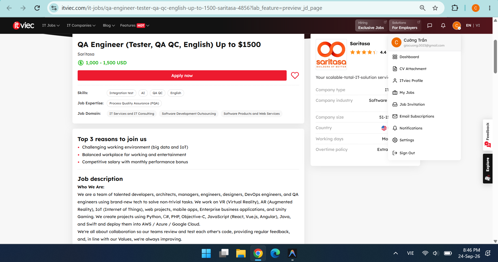  
  *(Ghi chú: Ảnh chụp màn hình rõ ngày đăng tin và thấy tài khoản chính chủ @Username ở góc màn hình)*

* **AI Impact Analysis (1–2 câu):**
  > [Phân tích tác động của AI đối với vai trò này: AI tự động hóa khâu nào, hỗ trợ khâu nào, và kỹ sư con người giữ vai trò gì để đảm bảo chất lượng?]

---

### Job #02: [Tên vị trí] – [Tên công ty] *(Vị trí có kỹ năng AI #2)*
* **Đường dẫn (Link gốc):** [URL tin tuyển dụng]
* **Ngày đăng tuyển:** dd/mm/2026
* **Mức lương:** ...
* **Yêu cầu kỹ năng chính:** ...
* **Mô tả công việc tóm tắt:** ...
* **Ảnh minh chứng tuyển dụng:**  
  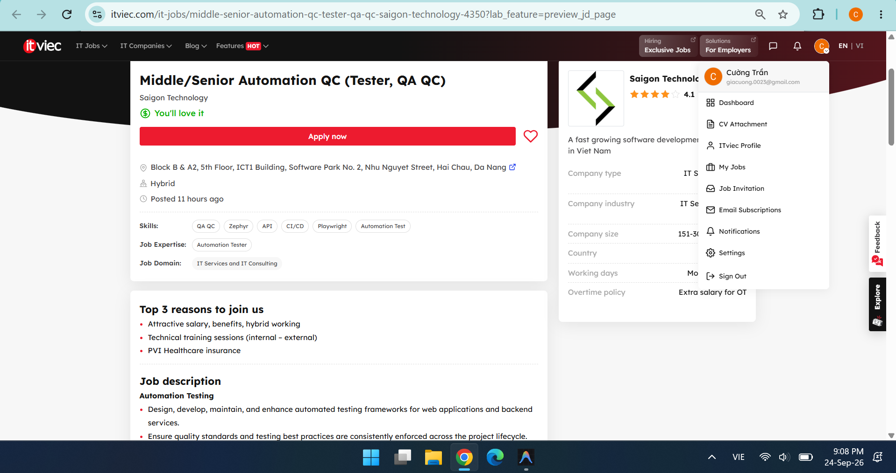  
* **AI Impact Analysis (1–2 câu):**  
  > ...

---

### Job #03: [Tên vị trí] – [Tên công ty] *(Vị trí có kỹ năng AI #3)*
* **Đường dẫn (Link gốc):** [URL tin tuyển dụng]
* **Ngày đăng tuyển:** dd/mm/2026
* **Mức lương:** ...
* **Yêu cầu kỹ năng chính:** ...
* **Mô tả công việc tóm tắt:** ...
* **Ảnh minh chứng tuyển dụng:**  
  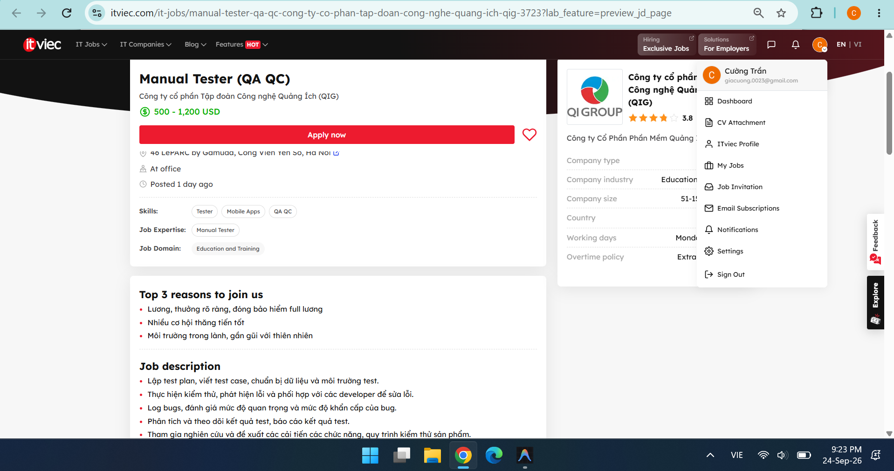  
* **AI Impact Analysis (1–2 câu):**  
  > ...

---

*(Điền tương tự cho các Job #04 đến Job #10)*

### Job #04: [Tên vị trí] – [Tên công ty]
* **Link:** ... | **Ngày:** ... | **Lương:** ...
* **Ảnh minh chứng:** 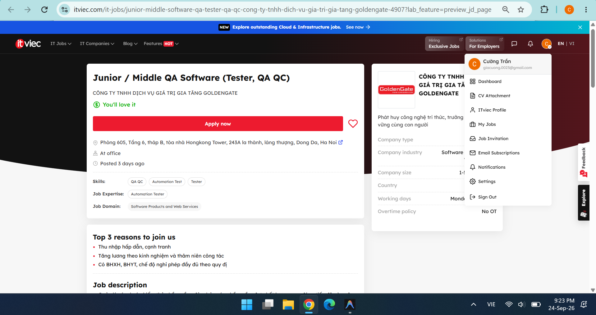
* **AI Impact Analysis:** > ...

### Job #05: [Tên vị trí] – [Tên công ty]
* **Link:** ... | **Ngày:** ... | **Lương:** ...
* **Ảnh minh chứng:** 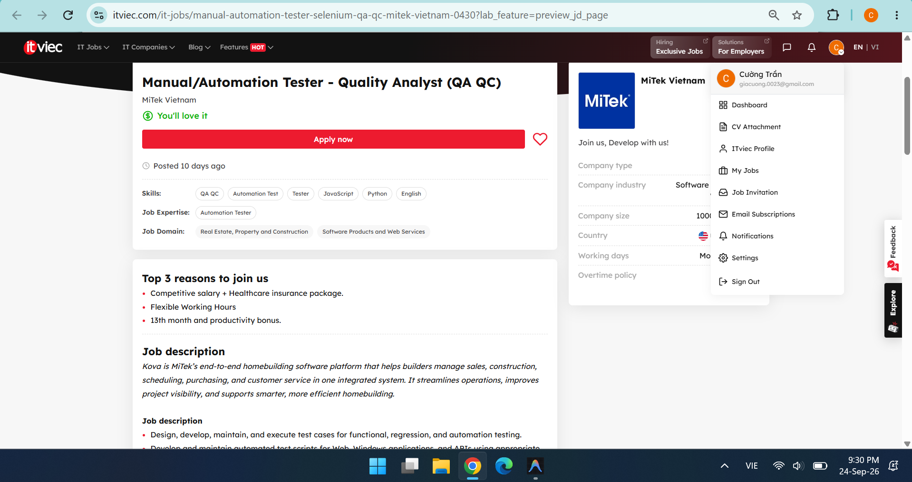
* **AI Impact Analysis:** > ...

### Job #06: [Tên vị trí] – [Tên công ty]
* **Link:** ... | **Ngày:** ... | **Lương:** ...
* **Ảnh minh chứng:** 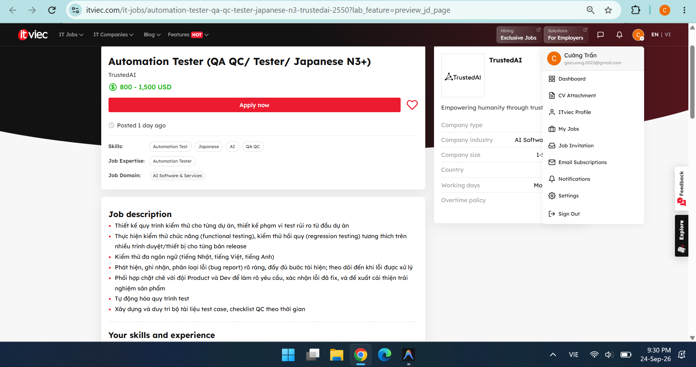
* **AI Impact Analysis:** > ...

### Job #07: [Tên vị trí] – [Tên công ty]
* **Link:** ... | **Ngày:** ... | **Lương:** ...
* **Ảnh minh chứng:** 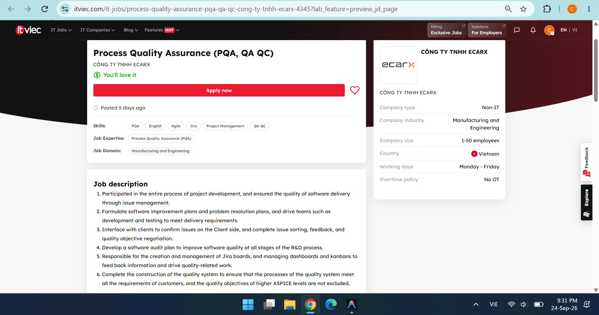
* **AI Impact Analysis:** > ...

### Job #08: [Tên vị trí] – [Tên công ty]
* **Link:** ... | **Ngày:** ... | **Lương:** ...
* **Ảnh minh chứng:** 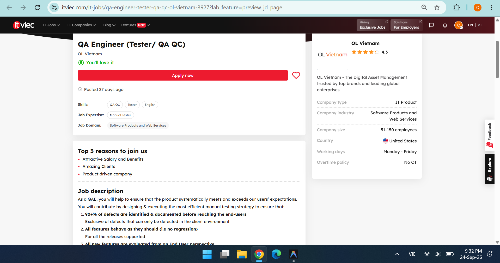
* **AI Impact Analysis:** > ...

### Job #09: [Tên vị trí] – [Tên công ty]
* **Link:** ... | **Ngày:** ... | **Lương:** ...
* **Ảnh minh chứng:** 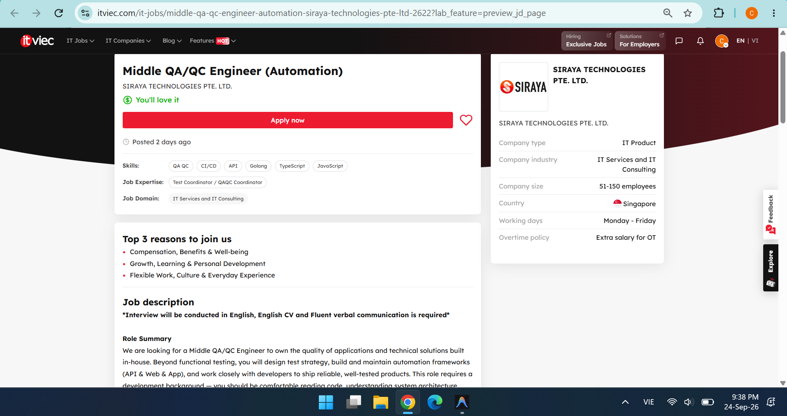
* **AI Impact Analysis:** > ...

### Job #10: [Tên vị trí] – [Tên công ty]
* **Link:** ... | **Ngày:** ... | **Lương:** ...
* **Ảnh minh chứng:** 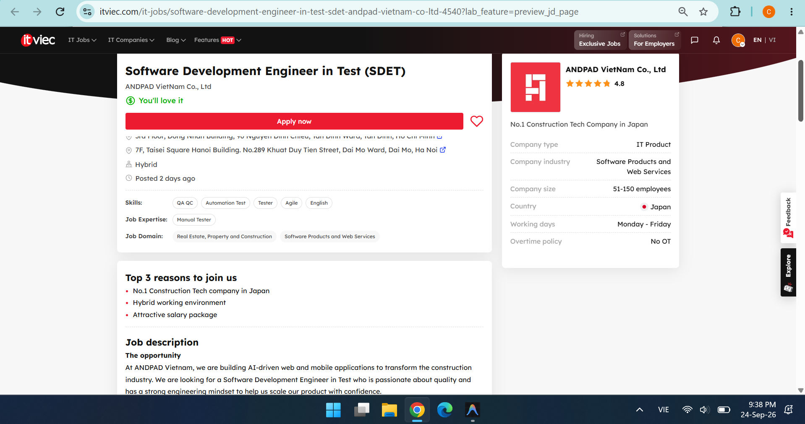
* **AI Impact Analysis:** > ...

---

## 1.3. CLO G9.1: Mindmap vai trò QA/QC theo chuẩn ISTQB & Phản biện AI

### A. Đặt câu hỏi cho AI (Prompt & AI Raw Output)
* **Công cụ AI sử dụng:** [Ví dụ: ChatGPT-4o / Claude 3.5 Sonnet / Google Gemini]
* **Thời gian thực hiện (Timestamp):** HH:MM dd/mm/2026
* **Nội dung Prompt:**
  > *"Hãy xây dựng cấu trúc mindmap phân bổ các vai trò QA/QC (Test Manager, Test Analyst, Technical Test Analyst, Test Automation Engineer, AI QA...) vào từng hoạt động của quy trình kiểm thử chuẩn ISTQB (Test Planning, Monitoring & Control, Analysis, Design, Implementation, Execution, Completion)."*
* **Tóm tắt kết quả AI trả về ban đầu:** [Mô tả ngắn hoặc trích đoạn kết quả sơ đồ ban đầu của AI]

### B. Chỉ ra 3 lỗi sai / thiếu sót của AI so với chuẩn ISTQB (Foundation Level)
1. **Lỗi 1 (Sai lệch hoạt động quy trình):**  
   * *Mô tả lỗi:* AI đã xếp vai trò `Test Automation Engineer` vào hoạt động `Test Analysis`.  
   * *Đối chiếu chuẩn ISTQB:* Theo ISTQB FL v4.0, khâu *Test Analysis* là xác định *"What to test"* (phân tích yêu cầu và điều kiện kiểm thử do Test Analyst đảm nhiệm). Tự động hóa kiểm thử thuộc về khâu *Test Implementation* và *Execution* (*"How to run"*).
2. **Lỗi 2 (Bỏ sót hoạt động kết thúc kiểm thử):**  
   * *Mô tả lỗi:* AI bỏ qua hoàn toàn giai đoạn `Test Completion` hoặc gộp chung vào Test Execution.  
   * *Đối chiếu chuẩn ISTQB:* ISTQB quy định *Test Completion* là hoạt động bắt buộc riêng biệt nhằm lưu trữ testware, đánh giá bài học kinh nghiệm (lessons learned) và bàn giao báo cáo tổng kết.
3. **Lỗi 3 (Đánh đồng khái niệm QA và QC/Testing):**  
   * *Mô tả lỗi:* AI dùng hoán đổi vai trò QA Lead thành Test Lead trong mọi giai đoạn thực thi.  
   * *Đối chiếu chuẩn ISTQB:* **QA (Quality Assurance)** mang tính phòng ngừa lỗi và tập trung vào quy trình (process-oriented), trong khi **QC / Testing** tập trung vào tìm kiếm lỗi trên sản phẩm (product-oriented).

### C. Sơ đồ Mindmap chuẩn hóa (Mermaid Diagram / Ảnh xuất)

```mermaid
flowchart TD
    ISTQB[ISTQB Test Process & QA/QC Roles]
    
    subgraph S1[1. Test Planning & Control]
        P1[Test Planning]
        P2[Test Monitoring & Control]
        R_TM[Test Management Role: Test Manager / QA Lead]
        P1 --- R_TM
        P2 --- R_TM
    end

    subgraph S2[2. Test Analysis - What to test]
        A1[Analyze Test Basis]
        A2[Identify Test Conditions]
        R_TA[Testing Role: Test Analyst / Business Analyst]
        A1 --- R_TA
        A2 --- R_TA
    end

    subgraph S3[3. Test Design - How to test]
        D1[Design Test Cases]
        D2[Design Test Data]
        R_TTA[Technical Test Analyst / Test Analyst]
        D1 --- R_TTA
        D2 --- R_TTA
    end

    subgraph S4[4. Test Implementation]
        I1[Develop Test Procedures / Automated Scripts]
        I2[Set up Test Environment]
        R_TAE[Test Automation Engineer / DevOps QA]
        I1 --- R_TAE
        I2 --- R_TAE
    end

    subgraph S5[5. Test Execution]
        E1[Execute Manual & Automated Tests]
        E2[Log Defects & Regression Testing]
        R_TE[Tester / AI Test Agent Operator]
        E1 --- R_TE
        E2 --- R_TE
    end

    subgraph S6[6. Test Completion]
        C1[Analyze Metrics & Lesson Learned]
        C2[Final Test Summary Report & Archive Testware]
        R_TMC[Test Manager / QA Lead]
        C1 --- R_TMC
        C2 --- R_TMC
    end

    ISTQB --> S1
    ISTQB --> S2
    ISTQB --> S3
    ISTQB --> S4
    ISTQB --> S5
    ISTQB --> S6
```

*(Bạn cũng có thể chèn ảnh xuất từ sơ đồ: ``)*

---

# REQUIREMENT 2 – 20 SOFTWARE DEFECTS 2022–2026 (20 PTS)

## 2.1. Bảng tổng hợp 20 sự cố phần mềm
*(Bắt buộc có tối thiểu 5 sự cố liên quan đến AI/LLM: Hallucination, Prompt Injection, Data Leak, Bias...)*

| STT | Tên sự cố / Phần mềm | Năm | Lĩnh vực | Mức độ (Severity) | Liên quan AI? |
| :---: | :--- | :---: | :--- | :---: | :---: |
| 1 | Air Canada Chatbot Hallucination Refund Policy | 2024 | Hàng không | High | **Có (AI)** |
| 2 | Google Gemini AI Historical Bias Image Generation | 2024 | GenAI | High | **Có (AI)** |
| 3 | Chevrolet Dealer Chatbot Prompt Injection (Bán xe $1) | 2023 | E-Commerce / LLM | Critical | **Có (AI)** |
| 4 | Samsung Electronics Internal Code Leak qua ChatGPT | 2023 | Bảo mật dữ liệu | Critical | **Có (AI)** |
| 5 | DPD Chatbot Swearing & Criticizing Company | 2024 | Chăm sóc khách hàng | Medium | **Có (AI)** |
| 6 | CrowdStrike Falcon Sensor BSOD Outage Toàn cầu | 2024 | OS / Hạ tầng | Critical | Không |
| 7 | [Tên sự cố 7] | 202... | ... | ... | ... |
| ... | ... | ... | ... | ... | ... |
| 20 | [Tên sự cố 20] | 202... | ... | ... | ... |

---

## 2.2. Chi tiết 20 lỗi phần mềm
*(Trình bày đủ 5 tiêu chí: Nguồn, Mô tả lỗi, Mức độ nghiêm trọng, Hậu quả, Giải pháp khắc phục)*

### Defect #01: Air Canada Chatbot Bịa đặt Chính sách Hoàn vé (2024) *(AI Defect #1)*
* **Nguồn tham khảo (Source Link):** [URL báo chí/vụ án dân sự]
* **Mô tả lỗi (Description):** Chatbot hỗ trợ khách hàng của Air Canada tự sinh ra (hallucination) quy trình giảm giá vé tang lễ không có thật trong chính sách, khuyên khách mua vé trước rồi xin hoàn tiền sau.
* **Mức độ nghiêm trọng (Severity):** High
* **Hậu quả (Consequences):** Hãng bay bị tòa án Canada phán quyết thua kiện và buộc phải bồi thường; uy tín của hệ thống hỗ trợ tự động bị tổn hại nghiêm trọng.
* **Giải pháp khắc phục (Solution):** Áp dụng RAG (Retrieval-Augmented Generation) nghiêm ngặt với kỹ thuật Grounding & Fact-checking, bắt buộc có cơ chế guardrails ngăn chặn chatbot tự suy diễn chính sách tài chính ngoài cơ sở dữ liệu.

*(Lặp lại chi tiết cho Defect #02 đến Defect #20)*

---

## 2.3. Phát hiện Ảo giác (Hallucination) hoặc Thiên kiến (Bias) của AI
* **Nội dung hỏi AI:** [Câu hỏi bạn yêu cầu AI giải thích về 1 sự cố cụ thể]
* **Điểm AI trả lời sai / thiên kiến / ảo giác:** [Chỉ rõ chi tiết sai lệch về mốc thời gian, số tiền thiệt hại, hoặc nguyên nhân kỹ thuật mà AI bịa ra]
* **Dẫn chứng sự thật đối chiếu:** [Trích xuất nguồn tin cậy chứng minh AI sai]

---

# REQUIREMENT 3 – TEST A PHYSICAL PRODUCT (25 PTS)

## 3.1. Thông tin thiết bị & Ảnh minh chứng chính chủ
* **Loại thiết bị gia dụng:** [Ví dụ: Quạt đứng thông minh / Nồi cơm điện tử / Bàn phím cơ / Ấm siêu tốc...]
* **Thương hiệu (Brand):** [Ví dụ: Xiaomi / Philips / Sunhouse / Keychron...]
* **Model:** [Ví dụ: Smart Fan 2 Lite...]
* **Năm sản xuất (Year):** [Ví dụ: 2023]
* **Số Serial:** `SN: ABC12****789` *(Đã che 4 ký tự ở giữa theo quy định)*
* **Ảnh chụp thiết bị kèm Thẻ sinh viên (Anti-cheat):**  
  
    
  *(Ảnh chụp rõ ràng toàn bộ thiết bị và Thẻ sinh viên trong cùng 1 khung hình)*

---

## 3.2. Bảng thiết kế 15 Test Cases
*(Bắt buộc có tối thiểu 3 Test Cases là Edge Cases mà AI không thể tự nghĩ ra)*

| Test ID | Mục tiêu kiểm thử (Objective) | Điều kiện tiên quyết | Dữ liệu đầu vào (Input) | Các bước thực hiện (Steps) | Kết quả mong đợi (Expected) | Kết quả thực tế (Actual) | Đánh giá (Verdict) | Ghi chú (Edge Case?) |
| :---: | :--- | :--- | :--- | :--- | :--- | :--- | :---: | :---: |
| **TC01** | Bật nguồn thiết bị | Đã cắm nguồn 220V | Nhấn nút Power | 1. Cắm dây nguồn 2. Nhấn nút Power | Đèn LED sáng, quạt quay số 1 | Như mong đợi | **PASS** | Normal |
| **TC02** | Chuyển cấp độ gió | Thiết bị đang bật | Nhấn nút Speed | 1. Nhấn lần lượt 1->2->3 | Tốc độ gió tăng dần tương ứng | Như mong đợi | **PASS** | Normal |
| ... | ... | ... | ... | ... | ... | ... | ... | ... |
| **TC13** | Rút điện đột ngột khi đang chạy tốc độ tối đa | Quạt đang quay số 3 | Rút phích cắm điện | 1. Bật quạt số 3 2. Giật mạnh phích cắm | Quạt dừng an toàn, không chập cháy | Ngắt nguồn tức thì, an toàn | **PASS** | **EDGE CASE #1 (Student self-designed)** |
| **TC14** | Nhấn đồng thời nút Nguồn và nút Hẹn giờ | Thiết bị đang tắt | Nhấn đè cả 2 nút 5 giây | 1. Dùng 2 ngón tay nhấn giữ đồng thời | Thiết bị không bị treo vi điều khiển | Không phản hồi lỗi | **PASS** | **EDGE CASE #2 (Student self-designed)** |
| **TC15** | Cắm điện lại sau khi mất nguồn đột ngột | Phích cắm vừa rút | Cắm lại phích cắm | 1. Cắm lại vào ổ điện | Thiết bị duy trì trạng thái an toàn (Standby, không tự bật) | Ở trạng thái Standby an toàn | **PASS** | **EDGE CASE #3 (Student self-designed)** |

---

## 3.3. Thực thi thực tế & Danh sách Video Demo
*(Thực thi tối thiểu 5 Test Cases, mỗi video $\le$ 60 giây, bắt buộc có giọng nói thuyết minh chính chủ, chế độ YouTube Unlisted)*

| STT | Test ID thực thi | Tên ca kiểm thử | Link YouTube (Unlisted) | Thời lượng | Ghi chú thuyết minh |
| :---: | :---: | :--- | :--- | :---: | :--- |
| 1 | **TC01** | Kiểm tra khởi động nguồn | [Dán URL YouTube] | 35s | Giọng thuyết minh MSSV: ... |
| 2 | **TC02** | Kiểm tra chuyển cấp độ gió | [Dán URL YouTube] | 42s | Giọng thuyết minh MSSV: ... |
| 3 | **TC13** | Edge case: Mất nguồn đột ngột | [Dán URL YouTube] | 48s | Giọng thuyết minh MSSV: ... |
| 4 | **TC14** | Edge case: Nhấn đè 2 nút cùng lúc | [Dán URL YouTube] | 50s | Giọng thuyết minh MSSV: ... |
| 5 | **TC15** | Edge case: Tự hồi phục sau mất điện | [Dán URL YouTube] | 45s | Giọng thuyết minh MSSV: ... |

---

# AI COLLABORATION PROTOCOL & COMPLIANCE (15 PTS)

## 4.1. AI Audit Report (Theo mẫu [AI-02])

### Bảng kiểm định các Artifact do AI tạo ra (5-section Audit Table)

#### Artifact #1: Cấu trúc Mindmap quy trình ISTQB (Requirement 1)
* **(1) Prompt + Công cụ + Timestamp:** ChatGPT-4o / 14:30 24/09/2026. Prompt: *"Xây dựng sơ đồ mindmap vai trò QA/QC trong quy trình ISTQB..."*
* **(2) AI Output nguyên văn:** [Dán đoạn trả lời nguyên văn của AI]
* **(3) Đánh giá (Verdict):** `INCOMPLETE` / `INVALID`
* **(4) Lý do đối chiếu ISTQB:** AI xếp Test Automation vào khâu Test Analysis (vi phạm phân định trách nhiệm FL §1.4).
* **(5) Phần chỉnh sửa của sinh viên:** Di chuyển Automation Engineer sang khâu Test Implementation & Execution, bổ sung khâu Test Completion.

#### Artifact #2: Gợi ý 15 Test Cases cho thiết bị vật lý (Requirement 3)
* **(1) Prompt + Công cụ + Timestamp:** Claude 3.5 Sonnet / 16:15 24/09/2026. Prompt: *"Tạo danh sách 15 test cases kiểm thử quạt điện..."*
* **(2) AI Output nguyên văn:** [Dán 15 test cases AI tạo ra]
* **(3) Đánh giá (Verdict):** `INCOMPLETE`
* **(4) Lý do đối chiếu ISTQB:** AI chỉ sinh ra các ca kiểm thử chức năng cơ bản (Happy path), hoàn toàn không nhận thức được môi trường vật lý (nguồn điện chập chờn, kẹt cơ khí, ẩm ướt).
* **(5) Phần chỉnh sửa của sinh viên:** Thay thế 3 test cases bằng các kịch bản Edge Cases vật lý (TC13, TC14, TC15).

---

### Bảng tổng kết độ chính xác của AI (Summary of AI Accuracy)

| Chỉ số | Số lượng artifact | Tỷ lệ phần trăm (%) |
| :--- | :---: | :---: |
| **Tổng số artifact AI đã kiểm định** | 2 | 100% |
| **VALID (Chính xác, giữ nguyên)** | 0 | 0% |
| **INVALID (Sai lệch, phải loại bỏ)** | 0 | 0% |
| **INCOMPLETE (Chưa đầy đủ, phải chỉnh sửa/bổ sung)** | 2 | 100% |

* **Kết luận khi nào nên / không nên dùng AI:**  
  > AI rất mạnh trong việc tạo khung mẫu ban đầu (drafting), liệt kê các luồng kiểm thử cơ bản (happy path) và tổng hợp thông tin nhanh chóng. Tuy nhiên, tuyệt đối không nên phụ thuộc hoàn toàn vào AI trong việc nhận diện các trường hợp biên vật lý (physical edge cases), các quy định chuẩn mực chuyên sâu (như ISTQB), hoặc kiểm tra tính đúng đắn của dữ kiện thực tế nếu không có sự thẩm định và phản biện kỹ lưỡng từ kỹ sư con người.

---

## 4.2. AI Critique (200–300 từ)
*(Đoạn văn phản biện bắt buộc về những điểm AI làm sai/thiếu và bài học hợp tác với AI)*

> [Viết đoạn văn 200–300 từ tại đây. Ví dụ định hướng: Trong quá trình thực hiện HW01, AI đã thể hiện rõ điểm hạn chế cốt lõi khi làm việc với các hệ thống gắn liền với thế giới vật lý và các tiêu chuẩn kiểm thử khắt khe. Cụ thể, khi thiết kế kịch bản cho thiết bị gia dụng, mô hình AI chỉ có thể suy diễn logic dựa trên văn bản mà thiếu đi sự thấu hiểu về các tương tác vật lý thực tế như hiện tượng quá nhiệt động cơ, độ trễ cơ học khi bấm phím, hay phản ứng an toàn khi mất nguồn đột ngột. Tương tự, khi vẽ sơ đồ ISTQB, AI có xu hướng tổng hợp từ ngữ phổ thông trên Internet dẫn đến việc đánh đồng thuật ngữ QA và QC. Bài học cốt lõi rút ra là: AI là một trợ thủ đắc lực giúp tăng tốc độ lên ý tưởng, nhưng kỹ sư QA luôn phải giữ vai trò là "chốt chặn chất lượng" cuối cùng, chủ động kiểm tra chéo với tài liệu chính thống và tự bổ sung các góc nhìn biên mà AI không thể bao quát.]

---

## 4.3. Mandatory Disclosure (Cam kết theo mẫu [AI-03])
*(Dán nguyên văn mẫu cam kết tiêu chuẩn)*

> *"Test cases and mindmap draft were initially generated by ChatGPT-4o and Claude 3.5 Sonnet; I reviewed and modified Section 1.3, added edge cases TC13, TC14, TC15 in Section 3.2; Section 1.2 (AI Impact Analysis), all video demonstrations, and photos were produced entirely by me. The detailed AI Audit Report is attached above. I confirm I did not use AI to generate any artifact listed in the prohibited category."*

* **Họ và tên sinh viên (Ký và ghi rõ họ tên):** [Điền họ tên]
* **Ngày cam kết:** dd/mm/2026

---

## 4.4. Bằng chứng chống gian lận & Kích hoạt FIT Mantis

* **Ảnh chụp màn hình trang chủ FIT Mantis (Tài khoản username = MSSV):**  
  
    
  *(Minh chứng tài khoản Mantis đã kích hoạt sẵn sàng cho HW02)*

---

# RUBRIC TỰ CHẤM ĐIỂM (SELF-ASSESSMENT)

| STT | Tiêu chí đánh giá | Điểm tối đa | Điểm tự chấm (Self-Assessed) | Sinh viên tự giải trình |
| :---: | :--- | :---: | :---: | :--- |
| **1** | **Requirement 1 – Job Market 2026+** (10 jobs × 3 pts + AI Impact + Mindmap) | 40 | [Điền điểm, VD: 40] | Đủ 10 tin $\le$ 60 ngày, 3 tin AI, phân tích đầy đủ, bắt 3 lỗi ISTQB |
| **2** | **Requirement 2 – 20 Software Defects** (20 lỗi, $\ge$ 5 lỗi AI, bắt lỗi bias) | 20 | [Điền điểm, VD: 20] | Đủ 20 lỗi chi tiết, 5 lỗi AI, chỉ rõ 1 điểm ảo giác |
| **3** | **Requirement 3 – Physical Product Test** (15 TCs + 3 edge cases + 5 videos) | 25 | [Điền điểm, VD: 25] | Đủ 15 TCs, 3 edge cases tự nghĩ, 5 video có giọng nói |
| **AI-1** | **[AI-02] AI Audit Report** (Bảng kiểm định 5 phần đầy đủ) | 8 | [Điền điểm, VD: 8] | Đủ 5 mục cho từng artifact, có tỷ lệ chính xác và kết luận |
| **AI-2** | **AI Critique** (200–300 từ) + **[AI-03] Disclosure** | 4 | [Điền điểm, VD: 4] | Đoạn văn phản biện đúng dung lượng, cam kết đầy đủ |
| **AI-3** | **[AI-05] Checklist** + **Anti-cheat Artifacts** (Mantis, Ảnh thẻ SV) | 3 | [Điền điểm, VD: 3] | Đủ ảnh thẻ SV + thiết bị, ảnh Mantis chính chủ |
| | **TỔNG ĐIỂM** | **100** | **[Tổng điểm, VD: 100]** | |

---

# PHỤ LỤC: DANH SÁCH FILE ĐÍNH KÈM
* `prompt_log.md`: Nhật ký lưu toàn bộ prompt và phản hồi theo mốc thời gian thực tế.
* `TestCases.xlsx`: Bảng tính Excel danh sách 15 test cases.
* Thư mục `screenshots/`: 10 ảnh tin tuyển dụng chính chủ + ảnh Mantis.
* `device_with_student_id.jpg`: Ảnh gốc chụp thiết bị cùng thẻ sinh viên.
* Các file cam kết AI đã ký: `[AI-02]`, `[AI-03]`, `[AI-05]`.
